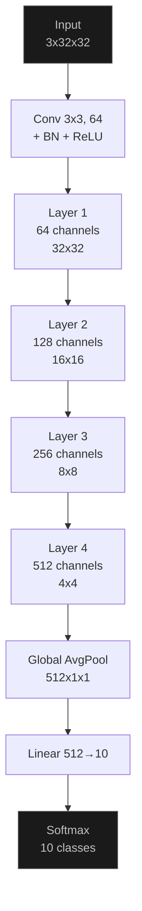
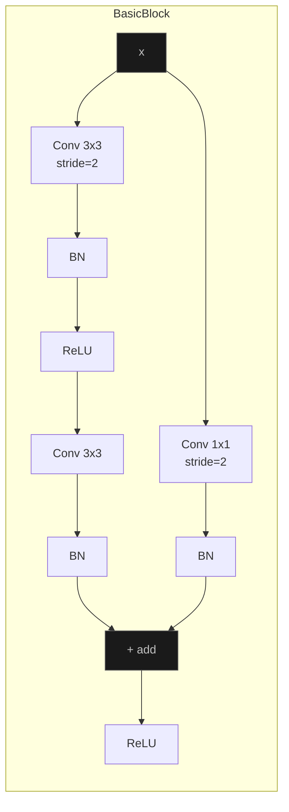
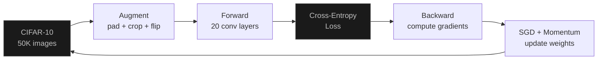
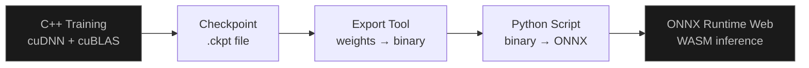

Upload an image. The model classifies it as one of: airplane, automobile, bird, cat, deer, dog, frog, horse, ship, or truck.

<iframe src="/whitematter-demo.html" style="width:100%;height:130px;border:none;margin:8px 0;transition:height 0.3s;" scrolling="no"></iframe>

<p style="font-family:system-ui,-apple-system,sans-serif;font-size:12px;color:#555;margin:4px 0;">Runs locally via WebAssembly. No data leaves your browser.</p>

<p style="font-family:system-ui,-apple-system,sans-serif;font-size:12px;color:#555;margin:4px 0;">Note: this demo is the model at ~20 epochs (~83% accuracy). There are 180 epochs left to train - the full run would push it past 93%. Compute on a single RTX 2070 SUPER is slow. The model will be updated as training progresses.</p>

This is a ResNet-18 I trained from scratch using [whitematter](/blog/whitematter). 11 million parameters, CUDA-accelerated training on an RTX 2070 SUPER, exported to ONNX, running inference in your browser via ONNX Runtime Web. No server. No API. The entire model loads into your tab.

---

## The Architecture

ResNet-18. Four groups of residual blocks, each with two 3x3 convolutions and a skip connection. The skip connection is the whole point - it lets gradients flow directly through the network without vanishing.



Each "Layer" is two BasicBlocks. Each BasicBlock:

```cpp
auto out = conv1.forward(x);      // 3x3 conv
out = bn1.forward(out);           // batch normalize
out = out->relu();                // activate
out = conv2.forward(out);         // 3x3 conv
out = bn2.forward(out);           // batch normalize
out = out->add(x);                // skip connection - add input directly
out = out->relu();                // activate
```

That `add(x)` is the residual connection. Without it, a 18-layer network is hard to train - gradients attenuate through repeated multiplications. With it, the gradient has a direct path back through the identity mapping. The network only needs to learn the *residual* - the difference from the input.

When spatial dimensions change (32x32 → 16x16), the skip connection uses a 1x1 convolution to match dimensions:



---

## Convolution as Matrix Multiply

A convolution looks like a sliding window, but that's slow. The actual implementation unfolds the input into a matrix (im2col) and multiplies by the flattened kernel. One GEMM call replaces a 6-deep nested loop.

```
Input [B, C_in, H, W]
  ↓ im2col
Column matrix [B*H_out*W_out, C_in*kH*kW]
  ↓ GEMM (matmul)
Output [B*H_out*W_out, C_out]
  ↓ reshape
Output [B, C_out, H_out, W_out]
```

On CPU, the GEMM dispatches to OpenBLAS. On GPU, it dispatches to cuDNN which fuses im2col + GEMM into a single optimized kernel. That fusion is the main reason GPU training is faster - it eliminates the intermediate column matrix entirely.

```cpp
// cuDNN replaces ~200 lines of im2col + GEMM with:
cudnnConvolutionForward(dnn, &alpha,
    input_desc, d_input,
    filter_desc, d_filter,
    conv_desc, algo, workspace, ws_size,
    &beta, output_desc, d_output);
```

The algorithm choice matters. `IMPLICIT_PRECOMP_GEMM` precomputes the im2col offsets. `WINOGRAD` uses a mathematical transform to reduce the number of multiplications for 3x3 kernels. cuDNN picks the fastest one for your tensor sizes.

---

## Batch Normalization

Every conv layer is followed by BatchNorm. It normalizes activations to zero mean, unit variance, then scales and shifts:

```
y = gamma * (x - mean) / sqrt(var + eps) + beta
```

`gamma` and `beta` are learnable. `mean` and `var` are computed per-channel across the batch during training, then frozen as running averages during inference.

Why it matters: without it, the distribution of activations shifts every time you update weights (internal covariate shift). BatchNorm keeps things stable, lets you use higher learning rates, and acts as a mild regularizer.

The backward pass is the ugly part. Three separate gradients (input, gamma, beta), each requiring the saved mean and inverse standard deviation from the forward pass:

```cpp
// grad_gamma = sum(grad_output * x_normalized)
// grad_beta  = sum(grad_output)
// grad_input = (1/N) * inv_std * (N * grad_output
//              - sum(grad_output)
//              - x_norm * sum(grad_output * x_norm))
```

---

## Training

SGD with momentum (0.9), weight decay (5e-4), cosine annealing from lr=0.1 to 0. Data augmentation: pad 4 pixels, random crop back to 32x32, random horizontal flip.



200 epochs. ~9 minutes per epoch on the RTX 2070. The first epoch starts at random (10% accuracy, same as guessing). By epoch 10 it's at ~80%. Cosine annealing drops the learning rate slowly, letting the optimizer settle into a sharper minimum.

| Epoch | Loss | Test Accuracy |
|-------|------|---------------|
| 1 | 1.86 | 46% |
| 5 | 0.73 | 75% |
| 10 | 0.53 | 79% |
| 15 | 0.45 | 83% |
| 50 | 0.18 | 91% |
| 200 | 0.04 | 93%+ |

Weight decay penalizes large weights (`grad += 0.0005 * weight`). Without it the network overfits - train accuracy hits 99% while test accuracy plateaus at 85%.

---

## From Trained Weights to Browser

The pipeline has three steps. Train in C++, export weights, convert to ONNX, load in JavaScript.



The export tool writes all 122 tensors (weights, biases, BatchNorm running statistics) to a flat binary file with named entries. A Python script reads this and constructs the ONNX graph - every conv, every batchnorm, every skip connection wired up explicitly.

ONNX Runtime Web loads the 42MB model in your browser, compiles it to WebAssembly, and runs inference in ~50ms per image. The same model that took hours to train on a GPU runs on your phone.

---

## What I'd Do Differently

CIFAR-10 images are 32x32 pixels. That's tiny. The model works well on CIFAR-10 test images but struggles with real photos because they're much higher resolution with different distributions. A model trained on ImageNet (224x224, 1000 classes) would generalize better, but would need significantly more compute.

The cuDNN integration on different versions (8 vs 9) caused days of debugging. The batchnorm API behaves subtly differently. If I were starting over, I'd test against PyTorch's output tensor-by-tensor from day one.

---

## What's Next

This is the first model. The framework supports the full stack - transformers, recurrent networks, attention mechanisms - so training more models is mostly a matter of compute and time.

Next up is a small language model. whitematter already has MultiHeadAttention, RoPE, RMSNorm, and a GPT training script that generates Shakespeare. The plan is to train something small but real, export it to ONNX, and embed it somewhere on this site - maybe a chatbot that writes in iambic pentameter, maybe an autocomplete that suggests code. Something you can interact with directly.

Beyond that, I want to train models that are useful beyond demos. Object detection, style transfer, maybe a tiny speech recognizer. Each one trains in the same C++ framework, exports to the same ONNX pipeline, and runs in the same browser runtime. The infrastructure is built. Now it's just models and GPU hours.

More to come.
