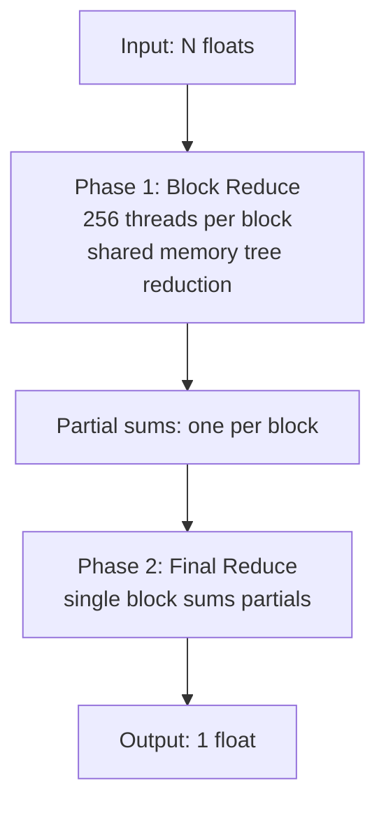
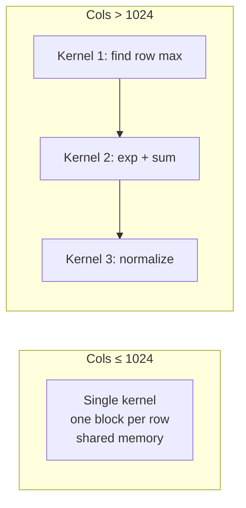
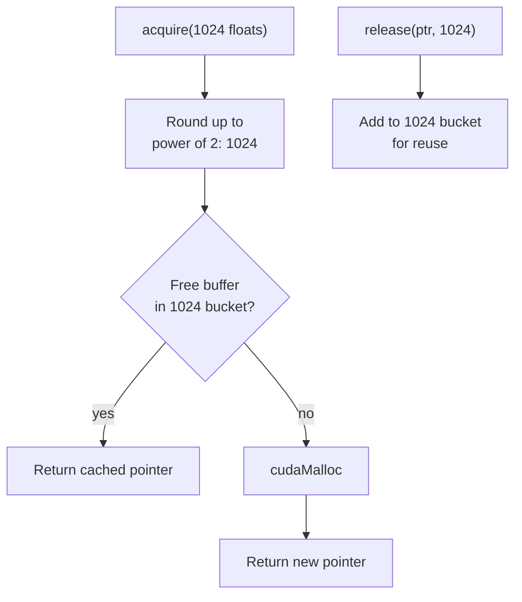

# CUDA

I have a working ML framework. Tensors, autograd, layers, optimizers  - runs on CPU with SIMD and BLAS, trains MNIST in seconds. Then I thought: how hard can GPU support be?

Every assumption you have about how computers work is slightly wrong on a GPU, and the wrongness compounds.

This is where I'm at right now. Not a tutorial. A dispatch from the middle.

**March 2026**

---

## Where Things Stand

Nine `.cu` files. About 2,000 lines of CUDA. Most of the kernels work individually. The problem is making them work *together*.

| Category | Kernels | Status |
|----------|---------|--------|
| Element-wise | add, sub, mul, div, scalar_mul, fill | Kernels done, backend wiring incomplete |
| Activations | ReLU, Sigmoid, Tanh, SiLU, GELU | Forward + backward working |
| BLAS | matmul, batched matmul, GEMV, AXPY | Working via cuBLAS |
| Reductions | sum, softmax, log_softmax | Working, perf issues |
| Loss | cross-entropy, MSE, BCE, NLL | Working |
| Optimizers | SGD, Adam, AdamW, RMSprop, grad clip | Working |
| Conv/Pool | Conv2d, BatchNorm, MaxPool, AvgPool | Working via cuDNN |

"Working" is doing a lot of heavy lifting in that table. Individually tested, yes. Wired into the framework end-to-end, not all of them.

---

## The Memory Wall

Computation is cheap. Data movement is expensive. The GPU can multiply a billion floats faster than it can *receive* them from the CPU.


That PCIe bottleneck is 50-60x slower than the GPU's internal bandwidth. Every host-to-device transfer is a toll booth on a highway.

My first `matmul()`:

```cpp
void CUDABackend::matmul(const float* h_A, const float* h_B,
                          float* h_C, int M, int K, int N) {
    float* d_A = pool.acquire(M * K);
    float* d_B = pool.acquire(K * N);
    float* d_C = pool.acquire(M * N);

    cudaMemcpy(d_A, h_A, M*K*sizeof(float), cudaMemcpyHostToDevice);
    cudaMemcpy(d_B, h_B, K*N*sizeof(float), cudaMemcpyHostToDevice);

    // cuBLAS call here...

    cudaMemcpy(h_C, d_C, M*N*sizeof(float), cudaMemcpyDeviceToHost);
}
```

Copy in. Compute. Copy out. For every single operation. Hundreds of ops per forward pass, and the GPU spends most of its time waiting for data over PCIe.

The fix is keeping tensors resident on the GPU  - allocate once, compute many times, only copy back when you need to read a value like the loss. But that means rewriting the tensor abstraction so it knows where its data lives, which means touching every operation, every autograd closure, every layer. That rewrite is ongoing.

---

## Row-Major vs. Column-Major

This one took me a full day to debug.

C++ is row-major. cuBLAS expects column-major (Fortran lineage). Pass row-major data to cuBLAS without accounting for this and you get wrong answers  - not errors, just quietly wrong results.

The trick: `B^T @ A^T` in column-major gives you `(A @ B)^T` in column-major, which is `A @ B` in row-major. So you swap the operands:

```cpp
// What you'd expect:
// cublasSgemm(handle, ..., M, N, K, A, K, B, N, C, N)

// What you actually write for row-major:
cublasSgemm(handle,
    CUBLAS_OP_N, CUBLAS_OP_N,
    N, M, K,        // dimensions swapped
    &alpha,
    d_B, N,          // B first, not A
    d_A, K,          // A second
    &beta,
    d_C, N);
```

Footgun that fires every time you add a new BLAS operation and forget the swap. Batched matmul has the same issue but with stride calculations layered on top.

---

## Writing Kernels

Element-wise addition:

```cpp
__global__ void add_kernel(const float* a, const float* b,
                            float* out, int n) {
    int idx = blockIdx.x * blockDim.x + threadIdx.x;
    if (idx < n) out[idx] = a[idx] + b[idx];
}
```

One thread per element. The simple kernels  - activations, element-wise ops  - are all this pattern. ReLU is `fmaxf(0.0f, x)`, sigmoid is `1.0f / (1.0f + expf(-x))`, each activation is maybe 10 lines. Trivial.

The problems start when you need *cooperation between threads*.

---

## Reductions Are Hard

Element-wise ops are embarrassingly parallel  - every element is independent. Reductions are the opposite: combine N values into one, which inherently requires communication.

Sum reduction uses a two-phase approach:



Softmax is worse. For each row: find the max (numerical stability), subtract and exponentiate, sum the exponentials, divide. Three reductions per row, each depending on the previous.

**Small rows (≤ 1024 elements):** One block per row. Shared memory for max, sum, normalization. Relatively clean.

**Large rows (> 1024 elements):** Three separate kernel launches. Temporary device buffers for per-row max and sum. Three launches mean three synchronization barriers.



The large-row path allocates temporary buffers on every call. That's `cudaMalloc` in the hot path. The memory pool helps, but it's still not zero-cost.

---

## The Synchronization Problem

GPUs are fast because they're asynchronous. Launch a kernel and the CPU continues immediately. But sometimes you need a result on the CPU before you can continue.

Gradient norm clipping has this problem  - you need the total norm (a scalar) to decide how to scale gradients:

```cpp
// Phase 1: partial norms on GPU
grad_norm_partial_kernel<<<blocks, 256>>>(params, d_partials, n);

// Phase 2: copy partials to CPU (synchronization point!)
float* h_partials = new float[num_blocks];
cudaMemcpy(h_partials, d_partials, num_blocks * sizeof(float),
           cudaMemcpyDeviceToHost);

// Sum on CPU
float norm_sq = 0.0f;
for (int i = 0; i < num_blocks; i++) norm_sq += h_partials[i];
float norm = sqrtf(norm_sq);

// Scale on GPU if needed
if (norm > max_norm) {
    float scale = max_norm / norm;
    grad_scale_kernel<<<blocks, 256>>>(params, scale, n);
}
```

That `cudaMemcpy` with `DeviceToHost` blocks until the GPU finishes. The whole pipeline stalls for one scalar. The right fix is doing the reduction and comparison entirely on the GPU, but conditional kernel launches add their own mess.

---

## Memory Management

`cudaMalloc` and `cudaFree` are slow. Hundreds of microseconds. In a training loop allocating temp buffers every operation, that adds up fast.

The solution is a memory pool:



Small allocations (≤ 64K floats) round to the nearest power of 2 for better cache hit rates. Large allocations use exact sizes. OOM recovery frees the entire cache and retries.

`shared_ptr` with custom deleters for automatic cleanup:

```cpp
std::shared_ptr<float> acquire_shared(size_t n) {
    float* ptr = acquire(n);
    return std::shared_ptr<float>(ptr, [this, n](float* p) {
        release(p, n);
    });
}
```

Buffer goes out of scope, returns to pool instead of being freed. Works well for temp buffers in autograd closures.

---

## cuDNN: Someone Else's Complexity

Convolutions and batch normalization use cuDNN. Writing a fast convolution kernel is a research problem  - I'm not going to beat their team.

The integration is straightforward but verbose:

```cpp
cudnnSetTensor4dDescriptor(input_desc, CUDNN_TENSOR_NCHW,
                            CUDNN_DATA_FLOAT, N, C, H, W);
cudnnSetFilter4dDescriptor(filter_desc, CUDNN_DATA_FLOAT,
                            CUDNN_TENSOR_NCHW, K, C, kH, kW);
cudnnSetConvolution2dDescriptor(conv_desc, pad, pad, stride, stride,
                                 1, 1, CUDNN_CROSS_CORRELATION,
                                 CUDNN_DATA_FLOAT);
```

```cpp
cudnnConvolutionForward(cudnn, &alpha, input_desc, d_input,
                         filter_desc, d_filter, conv_desc, algo,
                         workspace, workspace_size, &beta,
                         output_desc, d_output);
```

Workspace is pre-allocated at 8 MB. If it's too small, cuDNN falls back to slower algorithms  - no error, just worse performance. Silent degradation.

---

## What's Not Done

- **Backend wiring.** Kernels exist but aren't connected through the dispatch interface. Plumbing, not algorithms, but it blocks end-to-end GPU training.
- **Persistent device tensors.** Data copies CPU-GPU on every op. Need tensors that live on GPU and stay there. Touches `Tensor`, every op, every autograd closure.
- **Broadcasting.** Element-wise ops only handle same-shape on GPU. Mismatched shapes fall back to CPU. Device transfer for what should be a trivial kernel.
- **Async execution.** Everything synchronous. No overlapping compute with transfers, no CUDA streams.
- **Testing.** No GPU test suite. Need numerical comparison (GPU vs CPU results) and benchmarks.

---

## What I've Learned

GPU programming is not "write the same code but it runs on more cores." On CPU the bottleneck is computation. On GPU it's almost always memory.

The most important optimization isn't in any kernel. It's keeping the data on the GPU in the first place. I'm not there yet.

---

*2026*
