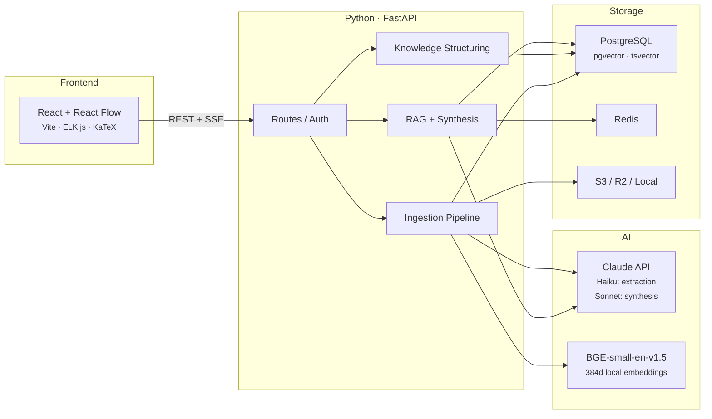
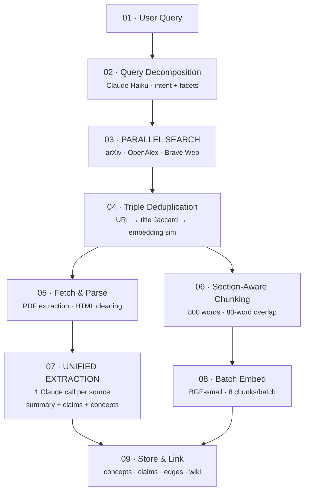
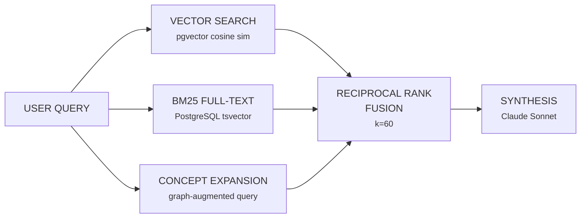
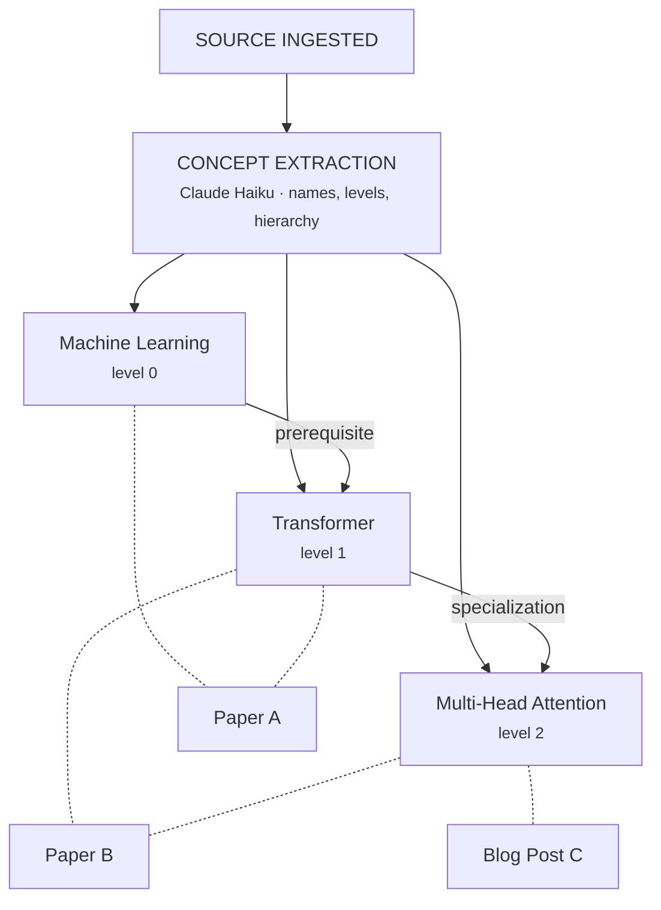
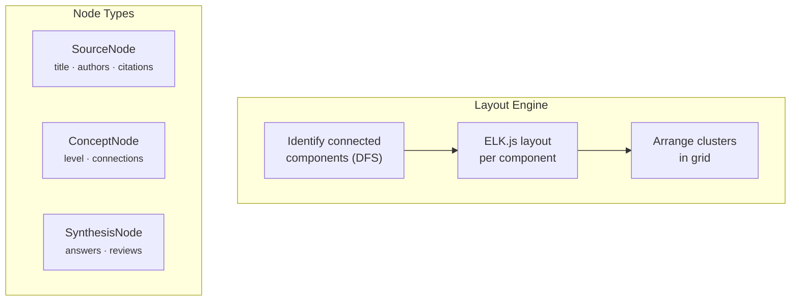

Research context is usually scattered across tabs, notes, and one-off searches. Search engines like Consensus answer "what does the literature say?" well, but they are mostly one-shot and academic-only. Marginalia keeps prior sources in the loop.

> [!side] The design goal is persistence: previous searches and ingested sources should affect later retrieval.

Marginalia finds, reads, and connects papers, blog posts, and notes. A workspace description seeds a knowledge base that later searches can reuse.

| Metric | Value |
|--------|-------|
| Route modules | **17** |
| Service modules | **40+** |
| Database migrations | **31** |
| Embedding dimensions | **384** |

---

## The Shape



Two model tiers: Haiku handles structured extraction (query decomposition, concept extraction, claim detection), and Sonnet handles user-facing synthesis. The system uses the lowest-cost model that is reliable for each subtask. Haiku is fine for decomposition. Sonnet is used where answer quality matters.

> [!side] Haiku is used for extraction. Sonnet is used where the text is user-facing.

---

## The Ingestion Pipeline

When you search for something, the query turns into embedded, structured, cross-linked knowledge.



### Query Decomposition

A single Claude Haiku call analyzes the query and returns intent ("research" vs "learn"), 2-3 refined search queries, and 5-8 paper recommendations. One call instead of three saves ~1-2 seconds.

### Multi-Source Parallel Search

Three sources searched simultaneously via `asyncio.gather()`:

```
 arXiv              OpenAlex            Brave Web
 ─────              ────────            ─────────
 Preprints          Published journals  Blogs, tutorials
 Bleeding-edge      Citation counts     Practitioner wisdom
 No paywalls        250M+ works         Grey literature
 No citation data   Lags on preprints   Noisy results
```

arXiv has fresh content but no citation graph. OpenAlex has broad citation data but lags on preprints. Web search catches blog posts and tutorials that academic sources miss.

Rate limiting: 1-second delays between API calls per source, 3-concurrent semaphore for PDF downloads (prevents memory spikes from 10-50MB PDFs), 1 pipeline semaphore overall (one ingestion at a time per process).

### Triple-Layer Deduplication

Before expensive operations, deduplication at three levels:

**Layer 1: URL normalization.** Strip trailing slashes, normalize protocol. Catches obvious duplicates across mirrors.

**Layer 2: Title Jaccard.** Tokenize titles, exclude stop words, compute set overlap. Threshold ≥ 0.5. Catches conference vs journal versions of the same paper.

**Layer 3: Embedding similarity.** For candidates that pass title match, content similarity ≥ 0.7 means duplicate. Catches blog post rewrites of papers.

URL matching misses different-host copies. Title matching misses rewrites. Embedding similarity is too expensive to run on everything. The cascade runs cheap-to-expensive.

### Section-Aware Chunking

Papers are not naively split into fixed-length blocks. Regex-based section detection identifies abstract, introduction, methods, results, discussion, conclusion. Chunks respect section boundaries with metadata attached.

```python
# Chunk parameters
CHUNK_SIZE = 800    # words, enough semantic content for meaningful embedding
OVERLAP = 80        # words, 10% overlap to preserve boundary context

# Each chunk carries metadata
chunk = {
    "content": text,
    "section_type": "methods",      # enables section-filtered retrieval
    "section_title": "3.2 Training",
    "chunk_index": 4,
}
```

Section metadata lets retrieval distinguish abstract claims from discussion speculation. Methodology questions can preferentially retrieve `methods` chunks. Sentences at chunk boundaries appear in both chunks.

### Unified Extraction

Previously 8 Claude calls per source. Now one Haiku call returns summary, thesis, methodology, key results, limitations, claims, and concepts. Same quality, ~8x fewer API calls.

```python
# One call, all structured data
response = await client.messages.create(
    model="claude-3-5-haiku",
    system=[{
        "type": "text",
        "text": EXTRACT_SYSTEM_PROMPT,
        "cache_control": {"type": "ephemeral"},  # ~30% latency savings
    }],
    messages=[{"role": "user", "content": source_text[:10000]}],
)
# Returns: summary, tldr, thesis, methodology, key_results,
#          limitations, datasets, contributions, claims, concepts
```

Prompt caching uses Anthropic's `cache_control: ephemeral`. The system prompt is identical across extraction calls, so it can be cached server-side.

---

## Hybrid Retrieval

A vector-only retriever misses exact terms, acronyms, and graph context. Marginalia runs three retrieval legs in parallel, then fuses results.



**Vector search** captures semantic meaning. "training instability" can match "loss divergence."

**BM25 full-text** catches exact terminology: model names, acronyms, equation references. Uses PostgreSQL's built-in `tsvector` with English stemming.

**Concept expansion** uses the graph during search. After ingesting papers on "attention mechanisms," the graph knows that "multi-head attention" relates to "scaled dot-product" and "query-key-value." Search for one, expand to the others.

```python
# Concept expansion: use workspace knowledge
concepts = db.query(Concept).filter(Concept.name.ilike(f"%{term}%"))
children = db.query(Concept).join(ConceptEdge).filter(
    ConceptEdge.parent_concept_id.in_(concept_ids)
)
expanded_query = original_query + " " + " ".join(related_concepts)
expanded_embedding = embed(expanded_query)
```

> [!side] Later queries use the graph built by earlier ingestion.

### Reciprocal Rank Fusion

The three retrieval legs produce scores on completely different scales: cosine similarity (0-1), BM25 (unbounded), concept expansion scores (different scale again). A raw average is not stable.

RRF only uses rank positions, not raw scores:

```python
def _rrf_fusion(result_lists, k=60):
    scores = defaultdict(float)
    for result_list in result_lists:
        for rank, item in enumerate(result_list):
            scores[item["id"]] += 1.0 / (k + rank + 1)
    return sorted(scores.items(), key=lambda x: x[1], reverse=True)
```

No training data. No tuned weights. k=60 is a constant from the original RRF paper. RRF is scale-invariant and works well across domains. For arbitrary research queries across arbitrary workspaces, stable behavior matters more than a small ranking improvement.

---

## Wiki-First RAG

Before going to raw chunks, the system checks its auto-generated wiki. Wiki pages are short summaries synthesized by Claude as sources are added.

```python
if wiki_page.similarity(query) >= 0.75:
    # Wiki page as primary context + 5 supporting chunks
else:
    # Fall back to 10 hybrid-search chunks
```

Raw chunks are noisy. A methods chunk might mention a concept in passing. Wiki pages are structured summaries. The 0.75 threshold is strict: only use wiki when there's a strong match.

Wiki generation runs on every source addition. Load the new source + 10 similar wiki pages, let Claude decide: create 2-5 new pages or update existing ones. Pages are cross-linked via `[[slug]]` and embedded for search.

> [!side] This keeps the wiki out of the user's workflow. Sources come in, pages update.

---

## Knowledge Structuring

### Concept Graph

Every source ingested feeds a growing concept graph. Concepts have levels: "machine learning" (level 0, foundational) vs "dropout regularization" (level 2, specialized). Edges encode relationships: prerequisite, specialization, related.



Levels help with learning paths (start foundational, build up) and canvas layout (foundational at top, specialized at bottom).

### Claim Extraction & Evidence Linking

Papers make claims. "BERT improves NER by 3.2 F1" is a claim. The system extracts claims from the first 15 chunks because papers usually front-load important content. Then it searches for supporting or contradicting evidence.

```python
# For each claim, find cross-workspace evidence
claim_embedding = embed_query(claim.claim_text)
matches = await vector_search(claim_embedding, limit=5)

# Claude classifies relationships
# Returns: supports | contradicts | qualifies | extends
```

Three papers support a claim, one contradicts it. The workspace stores that relationship explicitly.

### Deterministic Edge Generation

Source-to-source edges are generated without any LLM. It is deterministic, reproducible, and fast.

Three signals:

```python
# Signal 1: Shared concepts (≥2 = strong)
shared = concepts[source_a] & concepts[source_b]

# Signal 2: Title Jaccard (>0.5 = strong)
title_sim = len(words_a & words_b) / len(words_a | words_b)

# Signal 3: Embedding similarity (>0.70 = strong)
embedding_sim = cosine_similarity(avg_embed_a, avg_embed_b)

# Edge if any strong signal, or weak signals combined
strong = shared >= 2 or title_sim > 0.5 or embedding_sim > 0.70
weak_combined = shared >= 1 and (title_sim > 0.25 or embedding_sim > 0.60)
```

No model variance. No scores shifting between runs. Labels come from the most specific shared concept.

---

## Redundancy Detection

Workspaces accumulate overlapping sources. The system clusters them using average-linkage agglomerative clustering.

```python
def _cluster_average_linkage(source_ids, embeddings, threshold=0.78):
    clusters = [[sid] for sid in source_ids]
    while True:
        best_sim, best_i, best_j = 0.0, -1, -1
        for i in range(len(clusters)):
            for j in range(i + 1, len(clusters)):
                sim = avg_pairwise_cosine(clusters[i], clusters[j])
                if sim > best_sim:
                    best_sim, best_i, best_j = sim, i, j
        if best_sim < threshold:
            break
        clusters[best_i].extend(clusters[best_j])
        clusters.pop(best_j)
    return [c for c in clusters if len(c) >= 2]
```

Why average-linkage over single-linkage (union-find): single-linkage causes chain-clustering false positives. Papers A-B similar, B-C similar, but A-C dissimilar, and all three get merged. Average-linkage requires high average similarity. Threshold 0.78 avoids borderline merges.

---

## Quality Scoring

Every source gets a deterministic quality score blending three signals:

```
 AUTHORITY (40%)          RECENCY (25%)           RELEVANCE (35%)
 ──────────────          ─────────────           ───────────────
 Log-scale citations     Linear decay            Cosine similarity
 0 cites → 10           2026 → 95               Summary vs workspace
 100 cites → 50         2016 → 57               description
 10000 cites → 90       2006+ → 20              embedding distance
```

Authority uses log-scale because citation counts are log-normally distributed. The difference between 10 and 100 cites matters; 1000 vs 1100 usually does not. Recency uses linear decay. Older papers still score 20, not 0.

---

## The Canvas

The frontend renders a spatial knowledge graph using React Flow with ELK.js for layout.



ELK.js is used instead of d3-force because force-directed layouts get noisy quickly. ELK.js gives structured, hierarchical layouts and was originally built for compiler visualization.

The layout identifies connected components, lays each out independently, then arranges clusters in a grid. "transformer efficiency" and "training stability" stay visually separate.

Spacing constants: 80px node-to-node, 140px layer-to-layer, 240px cluster-to-cluster. Generous spacing makes the graph scannable.

---

## The Reader

Two-pane layout: PDF on the left (react-pdf), resizable sidebar on the right with notes, highlights, and per-paper Q&A. Text selection on the PDF surfaces a floating toolbar for annotation.

Per-paper Q&A uses only that source's chunks, so answers stay scoped to the open paper.

---

## Learning Path Generation

Given a workspace full of sources, the system generates a reading order.

Claude receives all source summaries + the concept graph, and produces a curriculum: step ordering, difficulty levels, prerequisites, key takeaways per step, and concepts covered. Reading time is computed from actual content length (~250 words/minute).

```python
# Reading time from content, not guesswork
total_chars = sum(len(c.content) for c in source.chunks)
estimated_minutes = max(1, round(total_chars / 5 / 250))
```

The concept graph constrains the ordering. Read attention mechanisms before flash attention.

---

## Design Decisions

### PostgreSQL + pgvector over vector databases

One database, one backup strategy, one connection pool. Vector search combines with SQL filters (`WHERE workspace_id = X`). HNSW indexes handle latency. No Pinecone/Weaviate overhead.

### Local embeddings over API embeddings

BGE-small-en-v1.5 runs on CPU. Zero per-call cost, no rate limits, no network latency. The quality is a bit lower than Voyage AI or Cohere, but at Marginalia's scale, removing API dependencies is worth it.

### SSE over WebSockets

Search progress is server-to-client only. SSE works over standard HTTP, auto-reconnects, and works through any proxy. Client writes still use regular POST requests.

### In-memory job tracking

```python
_jobs: dict[str, JobStatus] = {}  # 1-hour TTL cleanup
```

If the server restarts, job state disappears. This is acceptable for ephemeral search pipelines. Database polling would add latency for no practical benefit at single-server scale.

### Determinism over model calls

Edge generation, cluster labeling, and quality scoring are deterministic. LLMs are used for synthesis, gap analysis, and path ranking.

---

## Persistence

The design constraint: persistence.

A workspace with 80 embedded sources has graph history, wiki pages, claims, and source links. Later queries use that state instead of starting from empty context.

---

*marginalia · 2026*
