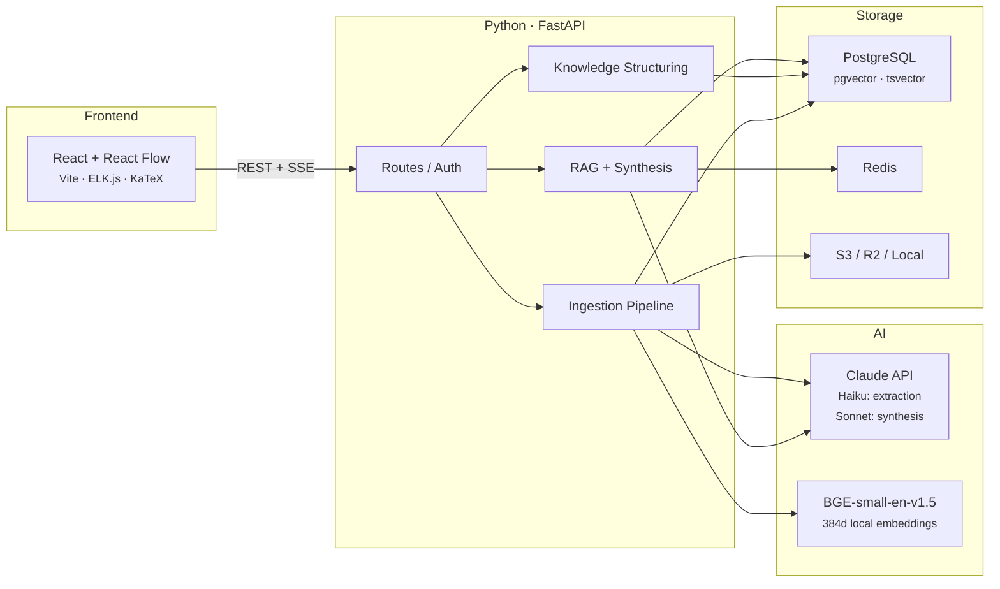
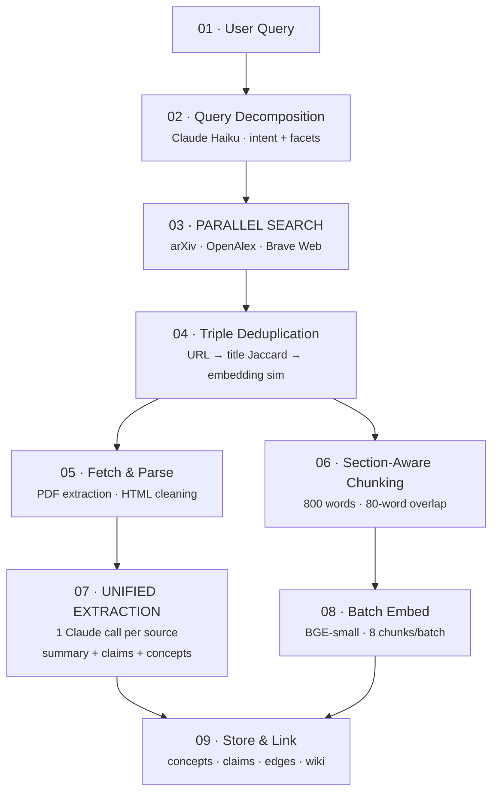
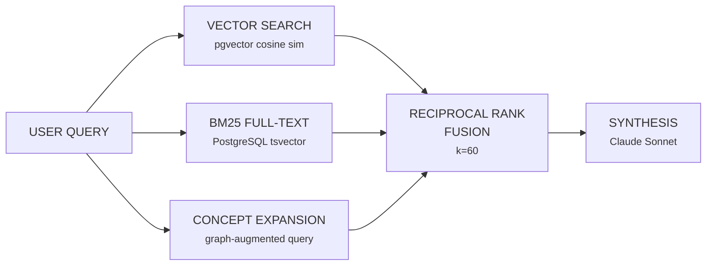
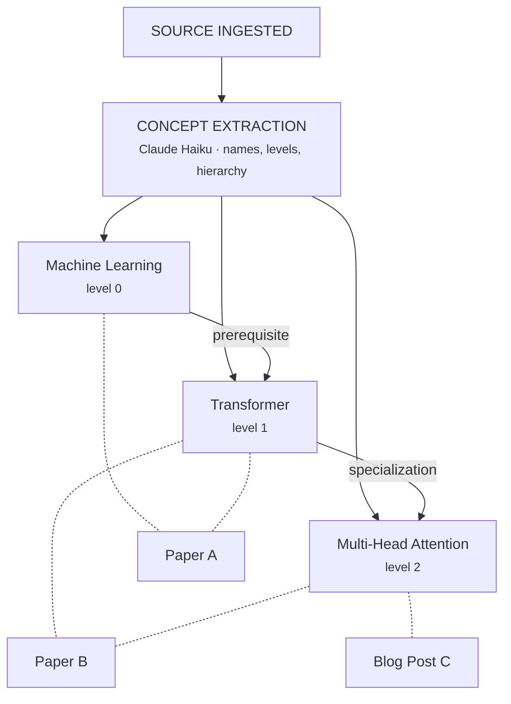
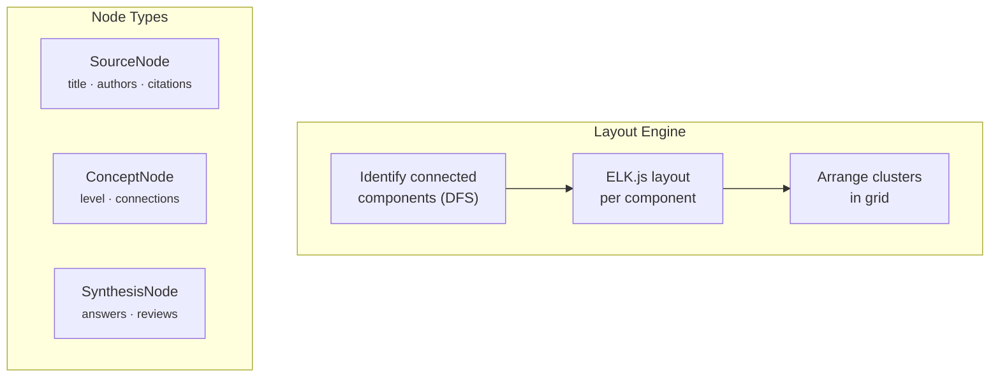

Research workflows are fragmented. Papers scatter across tabs, notes live in separate docs, and every session starts from zero. Search engines like Consensus answer "what does the literature say?" — a one-shot, stateless, academic-only search. I wanted something different: a workspace where query #50 benefits from everything you've already ingested.

Marginalia is a research workspace that finds, reads, and connects papers and blog posts — then compounds over time. You describe what you're investigating, and it builds a persistent, queryable knowledge base across academic and informal sources.

| Metric | Value |
|--------|-------|
| Route modules | **17** |
| Service modules | **40+** |
| Database migrations | **31** |
| Embedding dimensions | **384** |

---

## The Shape



Two-tier model cascade: Haiku for structured extraction (query decomposition, concept extraction, claim detection), Sonnet for user-facing synthesis. Cheapest model that produces acceptable quality for each subtask. Decomposition quality difference between Haiku and Sonnet is negligible — synthesis quality matters significantly.

---

## The Ingestion Pipeline

When you search for something, a cascade of operations turns a query into embedded, structured, cross-linked knowledge. This is the critical path — everything downstream depends on it.



### Query Decomposition

A single Claude Haiku call analyzes the user's query and returns intent classification ("research" vs "learn"), 2-3 refined search queries covering different facets, and 5-8 seminal paper recommendations. One call instead of three saves ~1-2 seconds on the critical path.

### Multi-Source Parallel Search

Three sources searched simultaneously via `asyncio.gather()`:

```
 arXiv              OpenAlex            Brave Web
 ─────              ────────            ─────────
 Preprints          Published journals  Blogs, tutorials
 Bleeding-edge      Citation counts     Practitioner wisdom
 No paywalls        250M+ works         Grey literature
 No citation data   Lags on preprints   Noisy results
```

Each fills the others' blind spots. arXiv has the freshest content but no citation graph. OpenAlex has comprehensive citation data but lags on preprints. Web search captures blog posts and tutorials that pure academic sources miss.

Rate limiting: 1-second delays between API calls per source, 3-concurrent semaphore for PDF downloads (prevents memory spikes from 10-50MB PDFs), 1 pipeline semaphore overall (one ingestion at a time per process).

### Triple-Layer Deduplication

Before expensive operations, deduplication at three levels:

**Layer 1: URL normalization.** Strip trailing slashes, normalize protocol. Catches obvious duplicates across mirrors.

**Layer 2: Title Jaccard.** Tokenize titles, exclude stop words, compute set overlap. Threshold ≥ 0.5. Catches conference vs journal versions of the same paper.

**Layer 3: Embedding similarity.** For candidates that pass title match — if content similarity ≥ 0.7, it's a duplicate. Catches blog post rewrites of papers.

No single signal is sufficient. URL matching misses different-host copies, title matching misses rewrites, embedding similarity alone is too expensive to run on everything. The cascade filters cheap-to-expensive.

### Section-Aware Chunking

Papers are not naively split into fixed-length blocks. Regex-based section detection identifies abstract, introduction, methods, results, discussion, conclusion. Chunks respect section boundaries with metadata attached.

```python
# Chunk parameters
CHUNK_SIZE = 800    # words — enough semantic content for meaningful embedding
OVERLAP = 80        # words — 10%, prevents context loss at boundaries

# Each chunk carries metadata
chunk = {
    "content": text,
    "section_type": "methods",      # enables section-filtered retrieval
    "section_title": "3.2 Training",
    "chunk_index": 4,
}
```

Why section-aware: retrieval can distinguish abstract claims (high confidence) from discussion speculation. "What's the methodology?" preferentially retrieves `methods` chunks. Sentences at chunk boundaries appear in both chunks.

### Unified Extraction

Previously 8 separate Claude calls per source. Now one Haiku call returns everything: summary, thesis, methodology, key results, limitations, claims, and concepts. Same quality, ~8x fewer API calls.

```python
# One call, all structured data
response = await client.messages.create(
    model="claude-3-5-haiku",
    system=[{
        "type": "text",
        "text": EXTRACT_SYSTEM_PROMPT,
        "cache_control": {"type": "ephemeral"},  # ~30% latency savings
    }],
    messages=[{"role": "user", "content": source_text[:10000]}],
)
# Returns: summary, tldr, thesis, methodology, key_results,
#          limitations, datasets, contributions, claims, concepts
```

Prompt caching via Anthropic's `cache_control: ephemeral` — the system prompt is identical across extraction calls, so it's cached server-side.

---

## Hybrid Retrieval

Most RAG systems do vector search and call it a day. Marginalia runs three retrieval legs in parallel, then fuses results.



**Vector search** captures semantic meaning — "training instability" matches "loss divergence."

**BM25 full-text** catches exact terminology — model names, acronyms, equation references. Uses PostgreSQL's built-in `tsvector` with English stemming.

**Concept expansion** is what makes the workspace compound. After ingesting papers on "attention mechanisms," the concept graph knows that "multi-head attention" relates to "scaled dot-product," "query-key-value," etc. When you search for one, the others auto-expand into the search.

```python
# Concept expansion: leverage workspace knowledge
concepts = db.query(Concept).filter(Concept.name.ilike(f"%{term}%"))
children = db.query(Concept).join(ConceptEdge).filter(
    ConceptEdge.parent_concept_id.in_(concept_ids)
)
expanded_query = original_query + " " + " ".join(related_concepts)
expanded_embedding = embed(expanded_query)
```

This is the compounding effect. Query #50 retrieves better results than query #1, because the concept graph has been built up by everything ingested before it.

### Reciprocal Rank Fusion

The three retrieval legs produce scores on completely different scales: cosine similarity (0-1), BM25 (unbounded), concept expansion scores (different scale again). You can't just average them.

RRF only uses rank positions, not raw scores:

```python
def _rrf_fusion(result_lists, k=60):
    scores = defaultdict(float)
    for result_list in result_lists:
        for rank, item in enumerate(result_list):
            scores[item["id"]] += 1.0 / (k + rank + 1)
    return sorted(scores.items(), key=lambda x: x[1], reverse=True)
```

No training data required. Parameter-free (k=60 is a constant from the original RRF paper). Scale-invariant. Competitive with learned-to-rank models in cross-domain settings — and for arbitrary research queries across arbitrary workspaces, robustness beats marginal accuracy gains.

---

## Wiki-First RAG

Before going to raw chunks, the system checks its auto-generated wiki. Wiki pages are pre-synthesized by Claude — clean, coherent summaries of topics that evolve incrementally as new sources are added.

```python
if wiki_page.similarity(query) >= 0.75:
    # Wiki page as primary context + 5 supporting chunks
else:
    # Fall back to 10 hybrid-search chunks
```

Raw chunks are noisy. A methods chunk might mention a concept tangentially. Wiki pages are structured, grounded summaries. The 0.75 threshold favors precision — only use wiki when there's a strong match.

Wiki generation triggers on every source addition. Load the new source + 10 most similar existing wiki pages, let Claude decide: create 2-5 new pages or update existing ones. Pages are cross-linked via `[[slug]]` syntax and embedded for semantic search. "Compound as you go" — the wiki stays current without manual effort.

---

## Knowledge Structuring

### Concept Graph

Every source ingested feeds a growing concept graph. Concepts have hierarchical levels — "machine learning" (level 0, foundational) vs "dropout regularization" (level 2, specialized). Edges encode relationships: prerequisite, specialization, related.



Levels enable learning path generation (start foundational, build up) and canvas layout (foundational at top, specialized at bottom).

### Claim Extraction & Evidence Linking

Papers aren't just documents — they're collections of claims. "BERT improves NER by 3.2 F1" is a claim. The system extracts claims from the first 15 chunks of each source (papers front-load important content — last third is references and appendices), then searches the workspace for supporting or contradicting evidence.

```python
# For each claim, find cross-workspace evidence
claim_embedding = embed_query(claim.claim_text)
matches = await vector_search(claim_embedding, limit=5)

# Claude classifies relationships
# Returns: supports | contradicts | qualifies | extends
```

Three papers support a claim, one contradicts it — that's useful information that no single search could surface.

### Deterministic Edge Generation

Source-to-source edges are generated without any LLM — entirely deterministic, reproducible, and fast.

Three signals:

```python
# Signal 1: Shared concepts (≥2 = strong)
shared = concepts[source_a] & concepts[source_b]

# Signal 2: Title Jaccard (>0.5 = strong)
title_sim = len(words_a & words_b) / len(words_a | words_b)

# Signal 3: Embedding similarity (>0.70 = strong)
embedding_sim = cosine_similarity(avg_embed_a, avg_embed_b)

# Edge if any strong signal, or weak signals combined
strong = shared >= 2 or title_sim > 0.5 or embedding_sim > 0.70
weak_combined = shared >= 1 and (title_sim > 0.25 or embedding_sim > 0.60)
```

No hallucination. No scores shifting between runs. Labels come from the most specific shared concept.

---

## Redundancy Detection

Workspaces accumulate overlapping sources. The system clusters them using average-linkage agglomerative clustering.

```python
def _cluster_average_linkage(source_ids, embeddings, threshold=0.78):
    clusters = [[sid] for sid in source_ids]
    while True:
        best_sim, best_i, best_j = 0.0, -1, -1
        for i in range(len(clusters)):
            for j in range(i + 1, len(clusters)):
                sim = avg_pairwise_cosine(clusters[i], clusters[j])
                if sim > best_sim:
                    best_sim, best_i, best_j = sim, i, j
        if best_sim < threshold:
            break
        clusters[best_i].extend(clusters[best_j])
        clusters.pop(best_j)
    return [c for c in clusters if len(c) >= 2]
```

Why average-linkage over single-linkage (union-find): single-linkage causes chain-clustering false positives. Papers A-B similar, B-C similar, but A-C dissimilar — all merged into one cluster. Average-linkage ensures all members have high average similarity to each other. Threshold 0.78 is conservative — prevents merging marginal cases.

---

## Quality Scoring

Every source gets a deterministic quality score blending three signals:

```
 AUTHORITY (40%)          RECENCY (25%)           RELEVANCE (35%)
 ──────────────          ─────────────           ───────────────
 Log-scale citations     Linear decay            Cosine similarity
 0 cites → 10           2026 → 95               Summary vs workspace
 100 cites → 50         2016 → 57               description
 10000 cites → 90       2006+ → 20              embedding distance
```

Authority uses log-scale because citation counts are log-normally distributed. The difference between 10 and 100 cites is meaningful; the difference between 1000 and 1100 is not. Recency uses linear decay — no cliffs at arbitrary 3/5/10-year boundaries. Seminal papers (20+ years old) still score 20, not 0.

---

## The Canvas

The frontend renders a spatial knowledge graph using React Flow with ELK.js for layout.



Why ELK.js over d3-force: force-directed layouts produce organic hairballs. ELK.js produces structured, hierarchical layouts — it's industrial-grade, originally built for compiler visualization. Mirrors how researchers think about concept hierarchies.

The layout identifies connected components (research threads), lays each out independently, then arranges clusters in a grid. A workspace studying "transformer efficiency" and "training stability" keeps those threads visually separate instead of mashing them together.

Spacing constants: 80px node-to-node, 140px layer-to-layer, 240px cluster-to-cluster. Generous spacing makes the graph scannable.

---

## The Reader

Two-pane layout: PDF on the left (react-pdf), resizable sidebar on the right with notes, highlights, and per-paper Q&A. Text selection on the PDF surfaces a floating toolbar for annotation.

Per-paper Q&A is scoped to that source's chunks — ask a question about a dense paper right there, no context-switching. Dense papers are confusing. The fastest resolution is asking right there.

---

## Learning Path Generation

Given a workspace full of sources, the system generates an optimal reading order.

Claude receives all source summaries + the concept graph, and produces a curriculum: step ordering, difficulty levels, prerequisites, key takeaways per step, and concepts covered. Reading time is computed from actual content length (~250 words/minute).

```python
# Reading time from content, not guesswork
total_chars = sum(len(c.content) for c in source.chunks)
estimated_minutes = max(1, round(total_chars / 5 / 250))
```

The concept graph constrains the ordering — you read about attention mechanisms before you read about flash attention. Hierarchical concept levels (foundational → specialized) enforce a natural learning progression.

---

## Design Decisions

### PostgreSQL + pgvector over vector databases

One database, one backup strategy, one connection pool. Vector search combined with SQL filters (`WHERE workspace_id = X`). HNSW indexes for millisecond latencies. No Pinecone/Weaviate operational overhead. At the scale Marginalia operates, a single Postgres instance with pgvector handles everything.

### Local embeddings over API embeddings

BGE-small-en-v1.5 runs on CPU. Zero per-call cost, no rate limits, no network latency. Slightly lower quality than Voyage AI or Cohere — but at Marginalia's scale, eliminating API dependencies wins.

### SSE over WebSockets

Search progress is server→client only. SSE works over standard HTTP, auto-reconnects, works through any proxy. No WebSocket ceremony. Client needs to send data? Regular POST.

### In-memory job tracking

```python
_jobs: dict[str, JobStatus] = {}  # 1-hour TTL cleanup
```

Job state lost on server restart — acceptable for ephemeral search pipelines. The alternative (database polling) adds latency for no practical benefit at single-server scale.

### Determinism over LLM magic

Edge generation, cluster labeling, quality scoring — all deterministic. No hallucination, no score drift between runs. LLMs are used only where judgment is required: synthesis, gap analysis, path ranking. Everything else is math.

---

## Where It Compounds

The core bet: persistence creates compounding value.

A workspace with 80 embedded sources and months of concept graph evolution is genuinely hard to recreate. Every source ingested makes the next query better — concept expansion reaches further, wiki pages get richer, claim evidence links get denser, learning paths get more precise.

Consensus treats every query as query #1. Marginalia treats it as query #51.

---

*marginalia · 2026*
