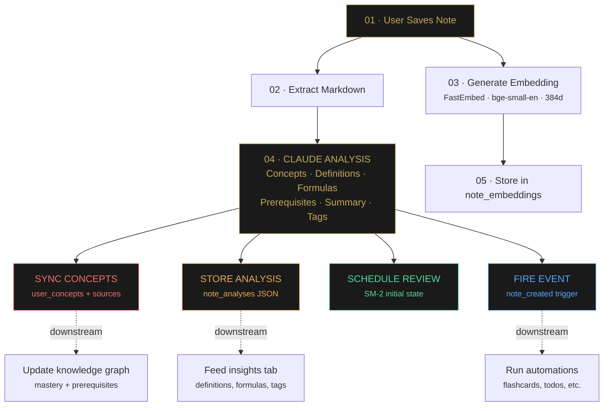
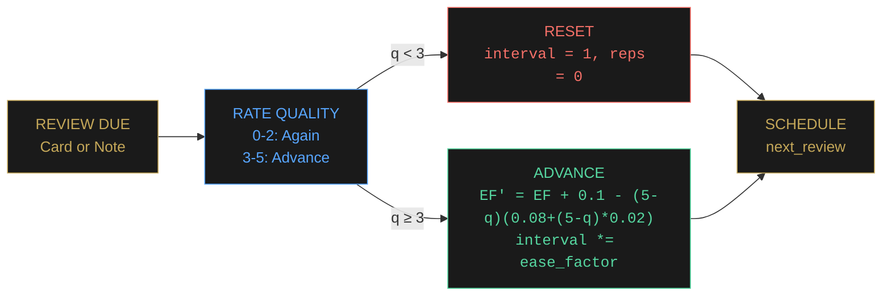
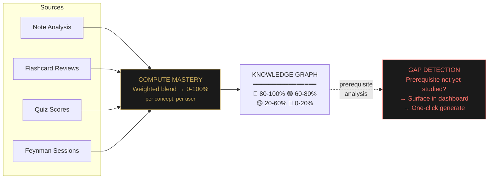
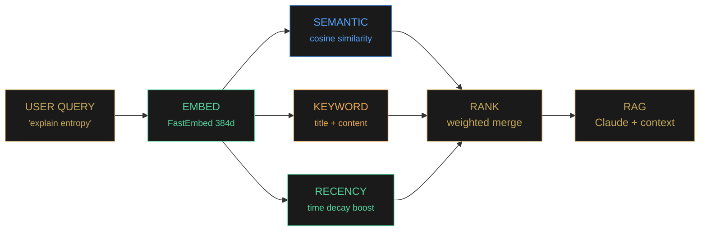
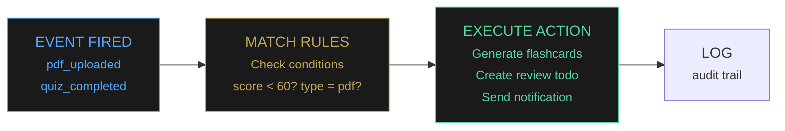

---

Neuronic treats notes as structured study data instead of plain documents.

Neuronic analyzes each note for concepts, prerequisites, definitions, and review state. From there, it can suggest flashcards, quizzes, weak areas, and what to study next.

> [!side] Notes become structured data. Flashcards and quizzes are views over the same graph.

| Metric | Value |
|--------|-------|
| Frontend pages | **28** |
| Database models | **50+** |
| Study modalities | **6** |
| Embedding dimensions | **384** |

---

## Feature Areas

Every major feature maps to one of seven stages:

```
┌─────────┐ ┌────────────┐ ┌──────────┐ ┌────────┐ ┌──────┐ ┌───────┐ ┌─────────────┐
│ 01       │ │ 02         │ │ 03       │ │ 04     │ │ 05   │ │ 06    │ │ 07          │
│ Capture  │ │ Understand │ │ Organize │ │ Retain │ │ Act  │ │ Track │ │ Collaborate │
└─────────┘ └────────────┘ └──────────┘ └────────┘ └──────┘ └───────┘ └─────────────┘
```

**Capture:** Multi-modal input: markdown, Excalidraw canvas, moodboards, PDF/PPTX uploads, YouTube transcript imports, arXiv ingestion, Whisper voice transcription, and a Chrome extension for web clipping.

**Understand:** AI analysis via Claude. Every note gets its concepts, definitions, formulas, prerequisites, and summaries extracted. This feeds the knowledge graph and concept mastery system.

**Organize:** Folders, tags, `[[bidirectional links]]`, and a force-directed graph connecting notes and concepts.

**Retain:** SM-2 spaced repetition on flashcards *and* notes, AI-generated quizzes, Feynman technique with voice-based explanation scoring, and Socratic dialogue where Claude probes your understanding.

**Act:** Study plans parsed from syllabi, todos, Pomodoro timers, focus mode, and an IFTTT-style automation engine.

**Track:** Dashboard with activity heatmaps, weak areas, trends, knowledge gaps, and reminders.

**Collaborate:** Study groups with shared notes, Q&A forum with voting and bounties, synchronized Pomodoro rooms, and friend activity feeds.

---

## System Architecture

Neuronic is a monorepo: React frontend, FastAPI backend, SQLite database. The AI layer sits between the backend and Claude's API, with FastEmbed handling local vector embeddings for hybrid search.


The backend is simple. SQLite in WAL mode handles concurrent reads. Async FastAPI keeps long-running AI calls from blocking the event loop. Redis caches hot paths like note lists and dashboard data. Celery handles background jobs like audio transcription and batch analysis.

API keys are encrypted at rest with Fernet symmetric encryption. Users can bring their own Anthropic keys, and they are never stored in plaintext. The server falls back to its own key pool when none is provided.

---

## The Note Analysis Pipeline

When you save a note, background jobs turn raw text into structured knowledge. Concept mastery, knowledge gaps, search, and study recommendations all depend on this pipeline.



Steps 3-5 run concurrently. The embedding is computed locally via FastEmbed (BAAI/bge-small-en-v1.5, 384 dimensions), so there is no external API call. Claude analysis runs in parallel and fans out to four consumers: concept sync, analysis storage, review scheduling, and the automation event bus.

---

## Spaced Repetition at Scale

SM-2 is applied to flashcards, notes, and concepts.

- **Flashcards**: Classic flip-and-rate. Quality 0-5, explicit user rating.
- **Notes**: Active recall mode. See the title, try to recall the content, rate your recall 1-4.
- **Quiz feedback loop**: Quiz scores passively update the source note's SM-2 state. Bad score? Shorter interval. Good score? It recedes.



**Example interval progression:**

```
 ┌──────┐    ┌──────┐    ┌──────┐    ┌──────┐    ┌──────┐
 │  1d  │ ─→ │  6d  │ ─→ │ 15d  │ ─→ │ 38d  │ ─→ │ 95d  │ ─→  ...
 │ new  │    │learn │    │review│    │mature│    │master│
 └──────┘    └──────┘    └──────┘    └──────┘    └──────┘
```

Quiz results update the source note's SM-2 state. Scores below 60% reset the interval so the note resurfaces sooner. Scores above 80% increase the ease factor.

---

## Knowledge Graph & Concept Mastery

Every concept extracted from every note becomes a node. Edges form when two concepts co-occur in the same document. Mastery is a weighted blend of flashcard performance, quiz scores, and Feynman technique assessments.



Gap detection compares a note's prerequisites against your known concepts. If you're studying eigenvalues but have never touched linear algebra, the dashboard shows that gap and gives you a button to generate a prerequisite note with Claude.

> [!side] The model is used to identify prerequisites and gaps, not to replace review.

---

## Hybrid Search & RAG

Search combines three signals: **semantic similarity** (cosine distance on 384-dim embeddings), **keyword matching** (substring in titles and content), and **recency boost** (recently edited notes rank higher). The RAG pipeline uses this same search to ground Claude's responses in your own notes.



---

## Six Study Modalities

### Flashcards
AI-generated with duplicate detection. Keyboard-driven sessions. SM-2 scheduling. Export to Anki.

### Quizzes
Multiple choice, true/false, fill-in-the-blank. Exam simulation mode with strict timers and no peeking.

### Note Review
Active recall queue. See the title, reconstruct the content mentally, rate your recall. SM-2 scheduled.

### Feynman Technique
Explain a concept aloud or in writing. AI scores your understanding 0-100 and identifies gaps.

### Socratic Dialogue
AI asks probing questions to test understanding. Adaptive difficulty based on your responses.

### Focus Sessions
Pomodoro timers, subject lock-in, distraction blocking, and streak tracking.

---

## The Automation Engine

The automation engine connects capture to studying. You define if-this-then-that rules: "PDF uploaded" can generate flashcards, create todos, post to forums, or send notifications.



Events process asynchronously via `fire_event()`. Every rule match is logged, and failed actions retry with exponential backoff.

---

*neuronic.study · 2026*
