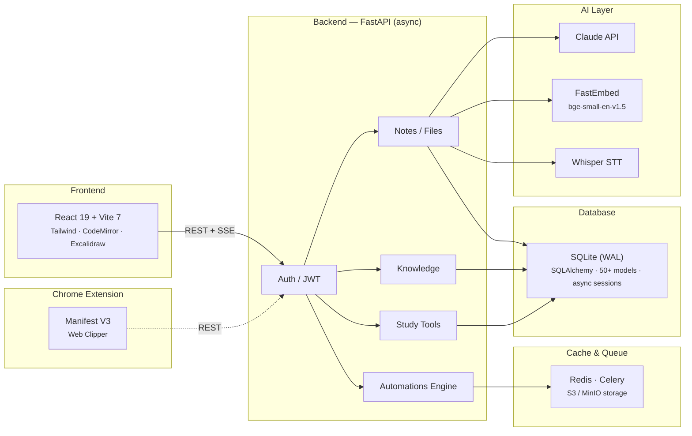
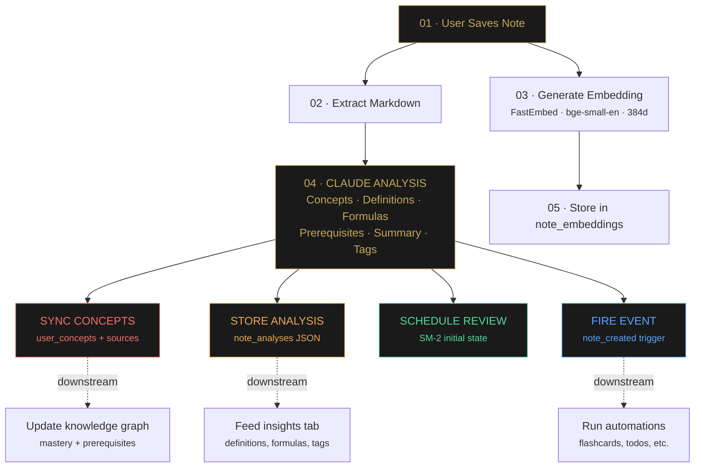
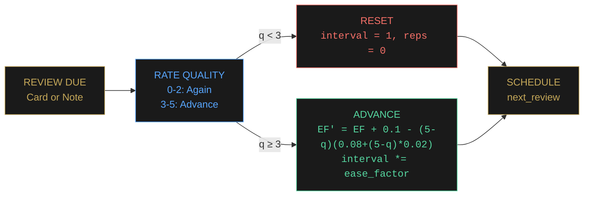
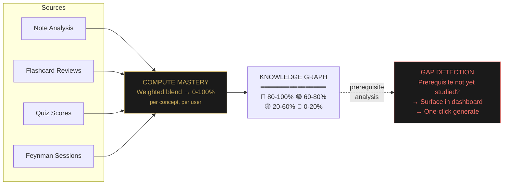
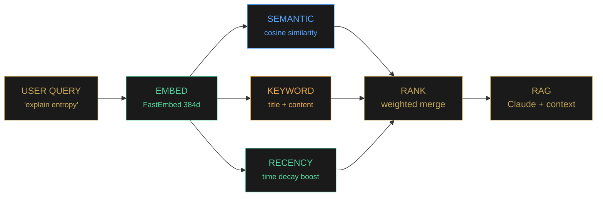
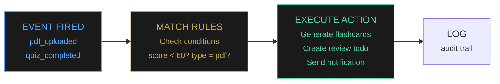

# Building Neuronic

*How we designed an AI study platform that doesn't just store your notes — it understands what you know, what you don't, and what to study next.*

**March 2026 · Engineering Deep Dive**

---

Most study apps are glorified text editors with a flashcard button bolted on. You type notes, maybe generate some cards, and hope for the best. There's no understanding of *what* you're learning, no sense of *how well* you know it, and no intelligence about *what to do next*.

We built Neuronic to change that. It's an AI-powered study platform where every note you create feeds into a living model of your knowledge — extracting concepts, tracking mastery, detecting gaps, and driving you toward real understanding through active recall, spaced repetition, and targeted practice.

This post is a technical deep dive into how it all works.

| Metric | Value |
|--------|-------|
| Frontend pages | **28** |
| Database models | **50+** |
| Study modalities | **6** |
| Embedding dimensions | **384** |

---

## The Seven Pillars of Learning

Neuronic is organized around a learning lifecycle. Every feature maps to one of seven pillars — not as a marketing gimmick, but as an engineering constraint. Every line of code must serve one of these stages:

```
┌─────────┐ ┌────────────┐ ┌──────────┐ ┌────────┐ ┌──────┐ ┌───────┐ ┌─────────────┐
│ 01       │ │ 02         │ │ 03       │ │ 04     │ │ 05   │ │ 06    │ │ 07          │
│ Capture  │ │ Understand │ │ Organize │ │ Retain │ │ Act  │ │ Track │ │ Collaborate │
└─────────┘ └────────────┘ └──────────┘ └────────┘ └──────┘ └───────┘ └─────────────┘
```

**Capture** is multi-modal: markdown notes, canvas diagrams (Excalidraw), visual moodboards, PDF/PPTX uploads, YouTube transcript imports, arXiv paper ingestion, voice recordings with Whisper transcription, and a Chrome extension for one-click web clipping.

**Understand** is where AI enters. Every note is analyzed by Claude to extract concepts, definitions, formulas, prerequisites, and summaries. This feeds into the knowledge graph and powers the concept mastery system.

**Organize** uses folders, tags, wiki-style `[[bidirectional links]]`, and a force-directed knowledge graph that visualizes connections between notes and concepts.

**Retain** is the engine — SM-2 spaced repetition applied to both flashcards *and* notes, plus AI-generated quizzes, the Feynman technique with voice-based explanation scoring, and a Socratic dialogue mode where Claude probes your understanding.

**Act** turns insight into action: study plans parsed from syllabi, todo management, Pomodoro timers, focus mode, and an IFTTT-style automation engine.

**Track** surfaces progress: a dashboard with activity heatmaps, weak area detection, performance trends, knowledge gap visualization, and smart nudges.

**Collaborate** enables study groups with shared notes, a Q&A forum with voting and bounties, synchronized Pomodoro rooms, and friend activity feeds.

---

## System Architecture

Neuronic is a monorepo with a React frontend, FastAPI backend, and SQLite database. The AI layer sits as a service between the backend and Anthropic's Claude API, with FastEmbed providing local vector embeddings for hybrid search.



The architecture is deliberately simple. SQLite in WAL mode handles concurrent reads without contention. The async FastAPI layer means long-running AI calls don't block the event loop. Redis caches hot paths (note lists, dashboard data), and Celery handles background jobs like audio transcription and batch analysis.

API keys are encrypted at rest with Fernet symmetric encryption. Users can bring their own Anthropic keys, which are never stored in plaintext — the server falls back to its own key pool when none is provided.

---

## The Note Analysis Pipeline

When you save a note, a cascade of background processing transforms raw text into structured knowledge. This pipeline is the backbone of everything else — concept mastery, knowledge gaps, smart search, and study recommendations all depend on it.



Steps 3-5 run concurrently. The embedding is computed locally via FastEmbed (BAAI/bge-small-en-v1.5, 384 dimensions) — no external API call needed. The Claude analysis runs in parallel and fans out to four downstream consumers: concept sync, analysis storage, review scheduling, and the automation event bus.

---

## Spaced Repetition at Scale

Most apps apply SM-2 to flashcards alone. We apply it to **everything** — flashcards, notes, and even concepts. The algorithm is the same, but the inputs differ:

- **Flashcards**: Classic flip-and-rate. Quality 0-5, explicit user rating.
- **Notes**: Active recall mode. See the title, try to recall the content, rate your recall 1-4.
- **Quiz feedback loop**: Quiz scores passively update the source note's SM-2 state. A bad quiz score shortens the review interval.



**Example interval progression:**

```
 ┌──────┐    ┌──────┐    ┌──────┐    ┌──────┐    ┌──────┐
 │  1d  │ ─→ │  6d  │ ─→ │ 15d  │ ─→ │ 38d  │ ─→ │ 95d  │ ─→  ...
 │ new  │    │learn │    │review│    │mature│    │master│
 └──────┘    └──────┘    └──────┘    └──────┘    └──────┘
```

The key innovation is the **quiz feedback loop**. When a user takes a quiz generated from a note, the score updates that note's SM-2 state. Score below 60%? The interval resets and the note surfaces in the review queue sooner. Score above 80%? The ease factor increases and the note recedes. This creates a passive spaced repetition layer that works even if the user never explicitly reviews notes.

---

## Knowledge Graph & Concept Mastery

The knowledge graph is where everything converges. Every concept extracted from every note becomes a node. Edges form when two concepts co-occur in the same document. Mastery is computed from a weighted blend of flashcard performance, quiz scores, and Feynman technique assessments.



The gap detection system is particularly useful. It compares a note's prerequisites against the user's known concepts. If you're studying eigenvalues but haven't encountered linear algebra, the dashboard surfaces that gap with a one-click button to auto-generate a prerequisite note via Claude.

---

## Hybrid Search & RAG

Search combines three signals: **semantic similarity** (cosine distance on 384-dim embeddings), **keyword matching** (substring search in titles and content), and **recency boost** (recently edited notes rank higher). The RAG pipeline uses this same search to ground Claude's responses in the user's own notes.



---

## Six Study Modalities

Learning isn't one-size-fits-all. Neuronic offers six distinct study modes, each targeting a different cognitive process:

### ✳ Flashcards
AI-generated with duplicate detection. Keyboard-driven study sessions. SM-2 scheduling. Export to Anki.

### ≣ Quizzes
Multiple choice, true/false, fill-in-the-blank. Exam simulation mode with strict timers and no peeking.

### ◎ Note Review
Active recall queue. See the title, reconstruct the content mentally, rate your recall. SM-2 scheduled.

### ♨ Feynman Technique
Explain a concept aloud or in writing. AI scores your understanding 0-100 and identifies gaps.

### ✧ Socratic Dialogue
AI asks probing questions to test your understanding. Adaptive difficulty based on responses.

### ▶ Focus Sessions
Immersive study with Pomodoro timers, subject lock-in, distraction blocking, and streak tracking.

---

## The Automation Engine

The automation engine bridges passive capture and active learning. Users define if-this-then-that rules: triggers fire on events like "PDF uploaded" or "quiz score below 60%", and actions execute asynchronously — generating flashcards, creating todos, posting to forums, or sending notifications.



The engine processes events asynchronously via `fire_event()`. Every rule match is logged for auditability, and failed actions retry with exponential backoff. This means a user can set up a rule like "whenever I upload a PDF, generate 10 flashcards and create a review todo for next week" — and never think about it again.

---

## What Makes This Different

There are hundreds of note-taking apps and dozens of flashcard apps. Here's what none of them do together:

> Most study apps are passive — they store what you put in. Neuronic is active — it asks what you don't understand, creates learning material automatically, tracks mastery in real-time, and nudges you toward what matters.

- **AI as co-learner, not just assistant.** Claude doesn't just answer questions — it analyzes your notes via RAG, detects knowledge gaps (missing prerequisites), generates flashcards intelligently (with dedup), and provides personalized study nudges.
- **SM-2 on everything.** Spaced repetition applied to both flashcards and notes, with quiz scores passively updating review schedules.
- **Concept mastery tracking.** Automatic concept extraction, prerequisite chains, mastery visualization, and gap detection — not found in any note app.
- **Multi-modal capture.** Voice recordings, PDFs, YouTube transcripts, arXiv papers, canvas diagrams, web clips — all feeding into the same knowledge system.
- **Automation engine.** IFTTT-style rules bridge passive capture and active learning.
- **No lock-in.** Export to Anki, Markdown ZIP, PDF, or compile AI study guides.

---

## What's Next

We're working on collaborative knowledge graphs (seeing where your study group's mastery overlaps and diverges), predictive study scheduling (ML-based "you'll forget this in 3 days" alerts), and a mobile app for review-on-the-go.

The core thesis remains: **studying should be intelligent, not just diligent**. Every feature we build serves one question: "Does this help the user understand more, in less time, with less friction?"

If it doesn't, we don't ship it.

---

*neuronic.study · 2026*
