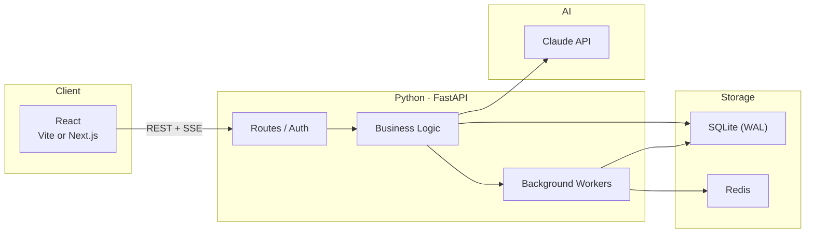
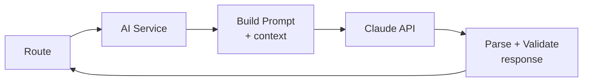
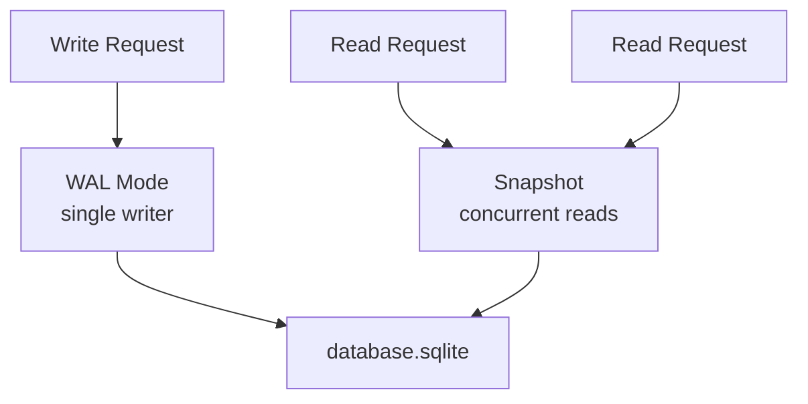
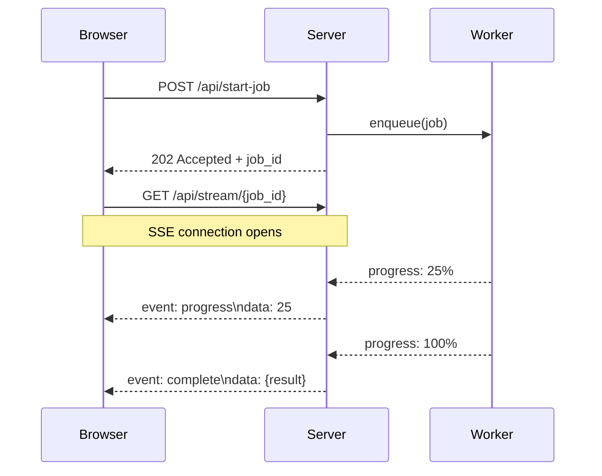
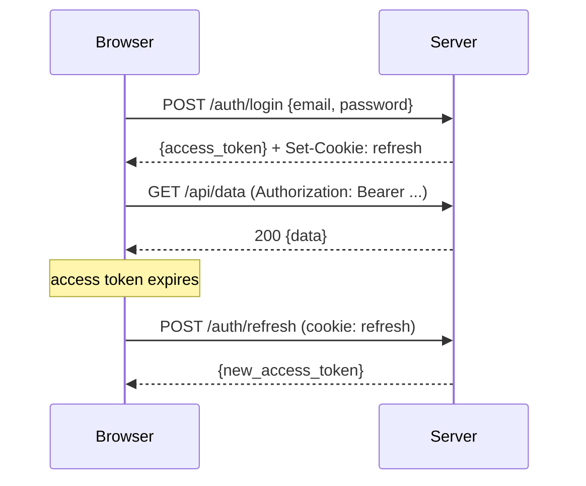

# The Stack

Every project I start looks the same for the first 48 hours. React on the front. FastAPI in the middle. Some combination of SQLite, Redis, and background workers in the back. Claude somewhere in the loop. SSE pushing data to the browser.

I didn't plan this as a template. It just kept happening — two projects in a row, same bones, different muscles. So I figured I'd write down what the skeleton actually looks like and why each piece is there.

**March 2026**

---

## The Shape



That's it. Five boxes, six connections. Everything I've built recently is a variation on this diagram.

The frontend handles rendering and user interaction. The backend handles logic, auth, and orchestration. Claude handles anything that requires language understanding. SQLite stores state. Redis caches hot paths and queues background work. SSE streams results back to the browser in real-time.

---

## Why FastAPI

I've used Express, Flask, Django. FastAPI wins on three things:

**Async by default.** When you're waiting on Claude to finish a 3-second API call, you don't want to block the whole process. FastAPI's async routes mean the server keeps handling other requests while one route is waiting on a response. This matters a lot when your app has an AI in the loop — every Claude call is a network round trip.

**Pydantic models.** Request and response schemas are Python classes. Type validation happens automatically. No manual parsing, no `request.json.get('field', default)` chains. The schema *is* the documentation.

**SSE support.** `StreamingResponse` with an async generator. That's all it takes to push real-time updates to the browser — training metrics, processing progress, streaming AI responses. No WebSocket ceremony, no socket.io dependency.

```python
@app.post("/api/process")
async def process(request: ProcessRequest):
    async def stream():
        async for chunk in run_pipeline(request):
            yield f"data: {json.dumps(chunk)}\n\n"
    return StreamingResponse(stream(), media_type="text/event-stream")
```

---

## The AI Layer

Claude sits behind a thin service layer. Never called directly from routes — always through a module that handles prompt construction, response parsing, and error recovery.



The service handles:
- **Prompt templates.** Jinja2 or f-strings depending on complexity. Context injection (user data, prior results) happens here.
- **Structured output.** Claude returns JSON. The service validates it against a Pydantic model before passing it upstream. If the JSON is malformed, retry once with a correction prompt.
- **Streaming.** For long generations, the service yields chunks to the route, which forwards them as SSE events.

The key decision: Claude never touches the database directly. It receives context, produces structured output, and the business logic layer decides what to do with it. This keeps the AI layer stateless and testable.

---

## SQLite, Seriously

Every time I reach for Postgres I ask myself: do I actually need it?

SQLite in WAL (Write-Ahead Logging) mode handles concurrent reads without contention. A single writer is fine when your write volume is "one user doing things." The database is a single file — no daemon, no connection strings, no Docker container for local dev.



SQLAlchemy async sessions on top. Models defined as Python classes. Alembic for migrations. The whole data layer is ~200 lines of boilerplate that I copy between projects.

When SQLite isn't enough — which in my case means "never so far" — the migration path to Postgres is swapping a connection string and running Alembic. The ORM abstracts the dialect. But I haven't needed it yet.

---

## Background Work

Some things can't happen in the request cycle. Audio transcription takes 10 seconds. Batch AI analysis takes longer. PDF processing is unpredictable. These go to background workers.

The pattern is always the same:

```
Request comes in → validate → enqueue job → return 202 Accepted
Worker picks up job → process → write results to DB
Client polls or receives SSE update
```

For simple cases: Python's `asyncio.create_task()` with a task registry. For anything with retry semantics or persistence guarantees: Celery with Redis as the broker.

The task registry pattern:

```python
tasks: dict[str, asyncio.Task] = {}

async def enqueue(job_id: str, coro):
    task = asyncio.create_task(coro)
    tasks[job_id] = task
    task.add_done_callback(lambda t: tasks.pop(job_id, None))
```

No external dependencies. Works for single-process deployments. When you need multi-process or crash recovery, swap in Celery — the interface to the rest of the app doesn't change.

---

## SSE Over WebSockets

I use Server-Sent Events for almost everything real-time. The argument for WebSockets is bidirectional communication. The argument against is everything else:

```
 SSE                           WebSockets
 ───                           ──────────
 HTTP/2 multiplexed            Separate protocol
 Auto-reconnect built in       Manual reconnect logic
 Works through proxies         Proxy support varies
 One-way (server → client)     Bidirectional
 ~10 lines of code             ~50 lines + heartbeat
```

If the client needs to send data, it uses a regular POST request. The server pushes updates over SSE. This covers training progress, AI streaming responses, processing status, live dashboards — basically every "real-time" feature I've built.



The `EventSource` API in the browser handles reconnection automatically. If the connection drops, it picks back up. No keepalive pings, no heartbeat timers.

---

## The Frontend

React with either Vite (for SPAs) or Next.js (when I need SSR/SSG). Tailwind for styling. No component library — I've found that copying 20 lines of CSS is faster than learning a library's API and fighting its opinions.

The frontend structure that keeps working:

```
src/
  components/     # UI primitives
  pages/          # route-level components
  lib/            # API client, utilities
  hooks/          # useSSE, useAuth, etc.
```

The `useSSE` hook is the most reused piece:

```typescript
function useSSE<T>(url: string | null) {
  const [data, setData] = useState<T | null>(null);

  useEffect(() => {
    if (!url) return;
    const source = new EventSource(url);
    source.onmessage = (e) => setData(JSON.parse(e.data));
    return () => source.close();
  }, [url]);

  return data;
}
```

Four lines of logic. Handles cleanup. Reactive. Covers 90% of the real-time use cases.

---

## Auth

JWT tokens. Short-lived access tokens (15 min), long-lived refresh tokens (7 days). The access token goes in the Authorization header. The refresh token goes in an httpOnly cookie.



Password hashing with bcrypt. API keys encrypted at rest with Fernet. No session storage on the server — the JWT *is* the session. Stateless auth means any server instance can validate any request.

For projects that don't need auth (tools, internal dashboards), I skip it entirely. No auth is better than half-implemented auth.

---

## Deployment

The simplest path that works:

```
 LOCAL DEV          STAGING              PRODUCTION
 ─────────          ───────              ──────────
 uvicorn            Docker on EC2        Docker on EC2
 SQLite file        SQLite file          SQLite + S3 backup
 npm run dev        nginx reverse proxy  nginx + SSL
                    GitHub Actions CD    GitHub Actions CD
```

One Dockerfile. One nginx config. One GitHub Actions workflow that builds, pushes, and restarts the service on push to main. SSL via Certbot.

No Kubernetes. No Terraform. No multi-region. A single EC2 instance handles more concurrent users than any of my projects have ever had. When that changes, the first thing I'll add is a second instance behind a load balancer — not a container orchestration platform.

---

## When This Breaks Down

This stack has limits and I've hit some of them:

**High write concurrency.** SQLite's single-writer model means write-heavy workloads queue up. A collaborative editing feature with 50 simultaneous writers would need Postgres. I haven't needed it yet, but I know where the ceiling is.

**Long-running connections at scale.** SSE holds an HTTP connection open per client. At a few hundred concurrent connections, this is fine. At ten thousand, you need connection pooling or a dedicated push service. Again — haven't hit it.

**CPU-bound work.** Python's GIL means CPU-heavy processing (image manipulation, heavy computation) blocks the event loop even in async code. The fix is either offloading to a subprocess (what Whitematter does with C++ compilation) or using a worker process.

**Multi-tenant isolation.** SQLite per tenant works up to maybe 100 tenants. Beyond that, you want a real database with row-level security. This is the point where I'd actually switch to Postgres.

The thing about knowing the limits is that you can build confidently up to them. Most projects never reach them. The ones that do have already proven they're worth the migration effort.

---

## The Point

I'm not arguing this is the best stack. I'm saying it's the stack where I spend zero time on infrastructure decisions and all my time on the actual problem.

Every hour spent choosing between message queues is an hour not spent building the thing. Every day configuring Kubernetes is a day the project doesn't ship. The best architecture is the one you can set up in an afternoon and forget about — until the project succeeds enough to need something bigger.

Two projects, same skeleton, different outcomes. One became a study platform. The other became a deep learning framework. The bones didn't matter. The muscles did.

---

*2026*
