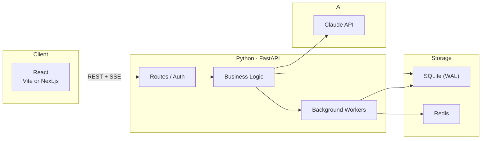
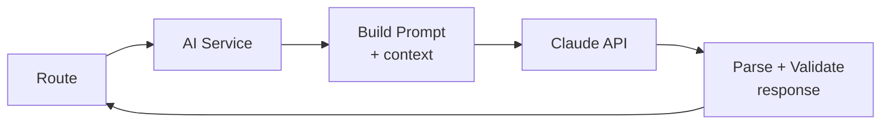
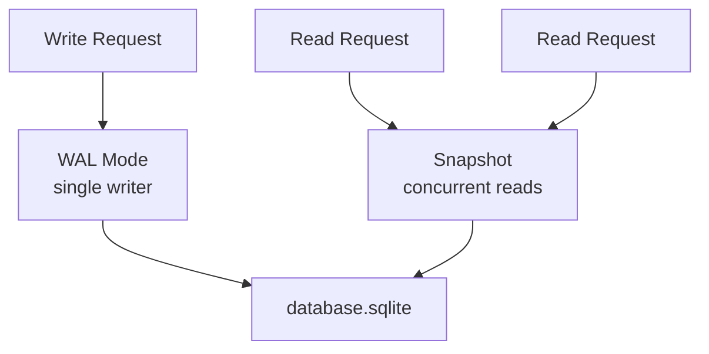
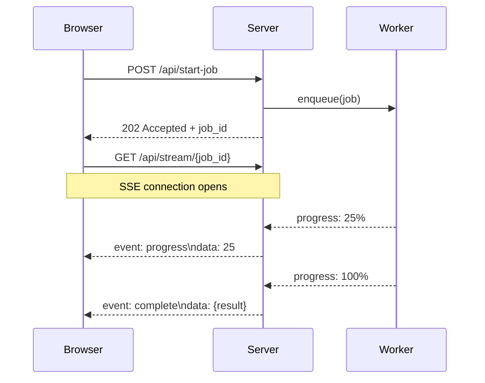

# The Stack

Every project I start looks the same. React up front, FastAPI in the middle, SQLite and Redis in the back, Claude somewhere in the loop, SSE pushing data to the browser. Two projects in a row, same bones  - so here's the skeleton.

**March 2026**

---

## The Shape



Five boxes, six connections. Everything I've built recently is a variation on this.

---

## Why FastAPI

I've used Express, Flask, Django. FastAPI wins on three things:

**Async by default.** Claude API calls take 3+ seconds. You don't want to block the process while waiting. Every AI-in-the-loop app is basically a bunch of network round trips.

**Pydantic models.** Request/response schemas are Python classes. Validation is automatic. The schema *is* the documentation.

**SSE support.** `StreamingResponse` with an async generator  - that's it for real-time updates. No WebSocket ceremony.

```python
@app.post("/api/process")
async def process(request: ProcessRequest):
    async def stream():
        async for chunk in run_pipeline(request):
            yield f"data: {json.dumps(chunk)}\n\n"
    return StreamingResponse(stream(), media_type="text/event-stream")
```

---

## The AI Layer

Claude sits behind a thin service layer. Never called directly from routes.



The service handles prompt templates (Jinja2 or f-strings), structured output validation against Pydantic models (retry once on malformed JSON), and streaming chunks back as SSE events.

The key decision: Claude never touches the database directly. It receives context, produces structured output, and the business logic layer decides what to do with it. Stateless and testable.

---

## SQLite, Seriously

Every time I reach for Postgres I ask myself: do I actually need it? The answer keeps being no.

SQLite in WAL mode handles concurrent reads without contention. Single writer is fine when your write volume is "one user doing things." The database is a single file  - no daemon, no connection strings, no Docker container for local dev.



SQLAlchemy async sessions on top, Alembic for migrations. ~200 lines of boilerplate I copy between projects. If I ever outgrow it, the migration path to Postgres is swapping a connection string.

---

## Background Work & SSE

Some things can't happen in the request cycle  - transcription, batch AI analysis, PDF processing. These go to background workers.

```
Request comes in → validate → enqueue job → return 202 Accepted
Worker picks up job → process → write results to DB
Client polls or receives SSE update
```

Simple cases: `asyncio.create_task()` with a task registry. Anything needing retries or persistence: Celery with Redis as broker.

```python
tasks: dict[str, asyncio.Task] = {}

async def enqueue(job_id: str, coro):
    task = asyncio.create_task(coro)
    tasks[job_id] = task
    task.add_done_callback(lambda t: tasks.pop(job_id, None))
```

For the real-time side, I use SSE over WebSockets for almost everything:

```
 SSE                           WebSockets
 ───                           ──────────
 HTTP/2 multiplexed            Separate protocol
 Auto-reconnect built in       Manual reconnect logic
 Works through proxies         Proxy support varies
 One-way (server → client)     Bidirectional
 ~10 lines of code             ~50 lines + heartbeat
```

Client needs to send data? Regular POST. Server pushes updates over SSE. This covers every "real-time" feature I've built.



---

## The Frontend

React with Vite (SPAs) or Next.js (SSR/SSG). Tailwind for styling. No component library.

```
src/
  components/     # UI primitives
  pages/          # route-level components
  lib/            # API client, utilities
  hooks/          # useSSE, useAuth, etc.
```

The `useSSE` hook is the most reused piece:

```typescript
function useSSE<T>(url: string | null) {
  const [data, setData] = useState<T | null>(null);

  useEffect(() => {
    if (!url) return;
    const source = new EventSource(url);
    source.onmessage = (e) => setData(JSON.parse(e.data));
    return () => source.close();
  }, [url]);

  return data;
}
```

Four lines of logic. Covers 90% of real-time use cases.

Auth is JWT  - short-lived access tokens, refresh tokens in httpOnly cookies. For projects that don't need it, I skip it entirely. No auth is better than half-implemented auth.

---

## Deployment

```
 LOCAL DEV          STAGING              PRODUCTION
 ─────────          ───────              ──────────
 uvicorn            Docker on EC2        Docker on EC2
 SQLite file        SQLite file          SQLite + S3 backup
 npm run dev        nginx reverse proxy  nginx + SSL
                    GitHub Actions CD    GitHub Actions CD
```

One Dockerfile, one nginx config, one GitHub Actions workflow. No Kubernetes. A single EC2 instance handles more concurrent users than any of my projects have ever had.

---

## When This Breaks Down

This stack has limits. SQLite's single writer chokes on high write concurrency. SSE holds a connection per client, which stops scaling at thousands. Python's GIL blocks the event loop on CPU-heavy work. I know where the ceilings are  - I just haven't hit them yet, and most projects never will. The ones that do have already proven they're worth the migration effort.

---

*2026*
