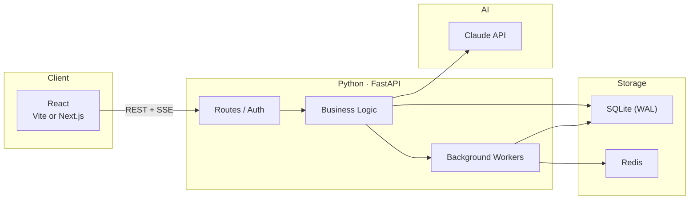
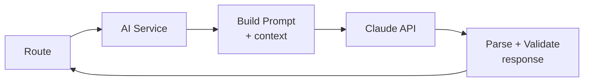
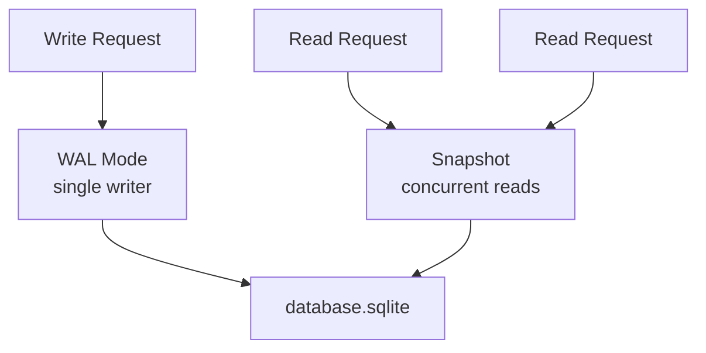
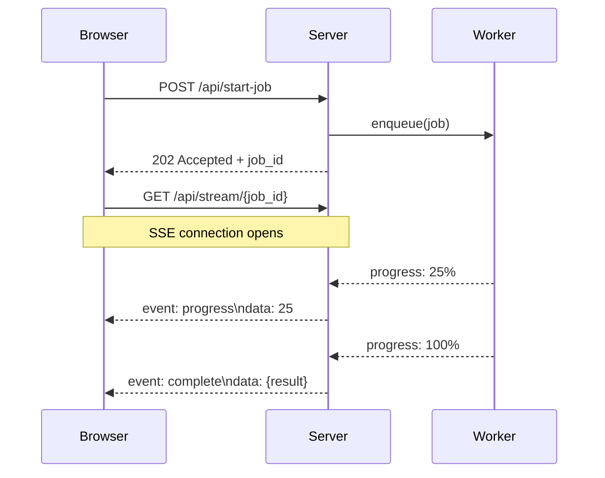

This is the default architecture I use for small AI projects: React up front, FastAPI in the middle, SQLite and Redis in the back, Claude behind a service layer, and SSE for progress updates.

> [!side] Scope: personal tools, prototypes, and single-developer projects.


---

## The Shape



Recent projects use this shape with small variations.

---

## Why FastAPI

FastAPI is useful here for three reasons:

**Async by default.** Claude API calls take 3+ seconds. The server should not block the process while waiting. AI-in-the-loop apps are mostly network round trips.

**Pydantic models.** Request/response schemas are Python classes. Validation is automatic. The schema *is* the documentation.

**SSE support.** `StreamingResponse` with an async generator covers one-way realtime updates.

```python
@app.post("/api/process")
async def process(request: ProcessRequest):
    async def stream():
        async for chunk in run_pipeline(request):
            yield f"data: {json.dumps(chunk)}\n\n"
    return StreamingResponse(stream(), media_type="text/event-stream")
```

---

## The AI Layer

Claude sits behind a thin service layer. Never called directly from routes.



The service handles prompt templates, Pydantic validation, one retry on malformed JSON, and SSE chunks.

Claude never touches the database directly. It gets context, returns structured output, and the business logic layer decides what to do.

---

## SQLite

For these projects, SQLite has been enough.

SQLite in WAL mode handles concurrent reads without contention. Single writer is fine for single-user or low-write-volume workflows. The database is a single file: no daemon, no connection strings, no Docker container for local dev.

> [!side] These are personal tools and prototypes first. If a project outgrows SQLite, the migration path is straightforward.



SQLAlchemy async sessions on top, Alembic for migrations. The shared database boilerplate is about 200 lines. Moving to Postgres is mostly a connection string change when the schema stays conventional.

---

## Background Work & SSE

Long-running tasks should not happen in the request cycle: transcription, batch AI analysis, PDF processing. These go to background workers.

```
Request comes in → validate → enqueue job → return 202 Accepted
Worker picks up job → process → write results to DB
Client polls or receives SSE update
```

Simple cases: `asyncio.create_task()` with a task registry. Anything needing retries or persistence: Celery with Redis as broker.

```python
tasks: dict[str, asyncio.Task] = {}

async def enqueue(job_id: str, coro):
    task = asyncio.create_task(coro)
    tasks[job_id] = task
    task.add_done_callback(lambda t: tasks.pop(job_id, None))
```

SSE is the default for progress updates:

```
 SSE                           WebSockets
 ───                           ──────────
 HTTP/2 multiplexed            Separate protocol
 Auto-reconnect built in       Manual reconnect logic
 Works through proxies         Proxy support varies
 One-way (server → client)     Bidirectional
 ~10 lines of code             ~50 lines + heartbeat
```

Client sends data with regular POST. Server pushes updates over SSE.



---

## The Frontend

React with Vite (SPAs) or Next.js (SSR/SSG). Tailwind for styling. No component library.

```
src/
  components/     # UI primitives
  pages/          # route-level components
  lib/            # API client, utilities
  hooks/          # useSSE, useAuth, etc.
```

The `useSSE` hook is the most reused piece:

```typescript
function useSSE<T>(url: string | null) {
  const [data, setData] = useState<T | null>(null);

  useEffect(() => {
    if (!url) return;
    const source = new EventSource(url);
    source.onmessage = (e) => setData(JSON.parse(e.data));
    return () => source.close();
  }, [url]);

  return data;
}
```

The wrapper is small and covers most one-way update flows.

Auth is JWT: short-lived access tokens, refresh tokens in httpOnly cookies. For projects that don't need it, I skip auth entirely.

---

## Deployment

```
 LOCAL DEV          STAGING              PRODUCTION
 ─────────          ───────              ──────────
 uvicorn            Docker on EC2        Docker on EC2
 SQLite file        SQLite file          SQLite + S3 backup
 npm run dev        nginx reverse proxy  nginx + SSL
                    GitHub Actions CD    GitHub Actions CD
```

One Dockerfile, one nginx config, one GitHub Actions workflow. No Kubernetes. A single EC2 instance is enough for the current project scale.

---

## When This Breaks Down

This stack has limits. SQLite's single writer becomes a bottleneck under high write concurrency. SSE holds a connection per client. Python's GIL blocks the event loop on CPU-heavy work.

---
