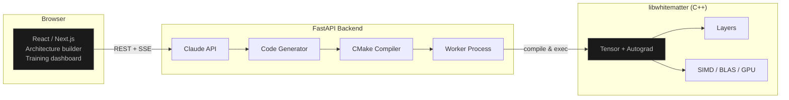
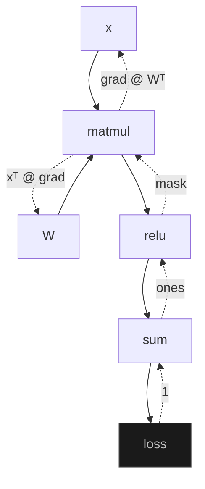
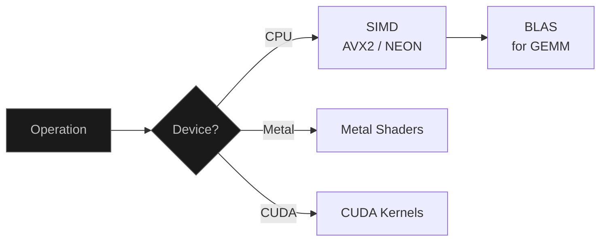
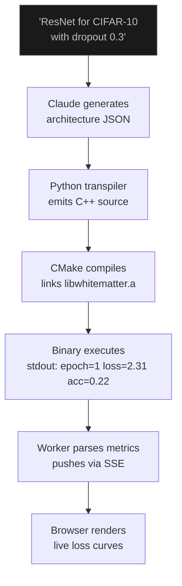

Whitematter is a small deep learning framework written in C++. It implements tensors, autograd, layers, optimizers, CPU kernels, and GPU backends.

> [!side] The goal was to inspect the implementation path between `loss.backward()` and a weight update.

The web UI generates C++ training programs, compiles them, runs them, and streams metrics back to the browser.


---

## The Numbers

| | |
|--------|-------|
| Tensor operations | **100+** |
| Layer types | **20+** (Conv2d, LSTM, MultiHeadAttention, ...) |
| C++ source | **~90,000 lines** |
| GPU backends | **Metal** (macOS) + **CUDA** (NVIDIA) |
| MNIST convergence | **99%+ accuracy, 3 epochs** |

---

## How the System Fits Together

Three layers. The browser talks to a Python API. The API generates C++ code, compiles it, and runs it. Training metrics stream back in real-time.



No Python in the training loop. The backend transpiles an architecture description into C++ source, links it against the static library, and runs the binary directly.

---

## Tensors and Autograd

The tensor is a contiguous float buffer with shape metadata, stride info, and a pointer to the function that created it. That pointer is the autograd system. Every operation records a closure that knows how to compute its gradient.

```cpp
auto x = Tensor::randn({64, 784}, true);   // requires_grad=true
auto W = Tensor::randn({784, 128}, true);
auto h = x->matmul(W)->relu();
auto loss = h->sum();
loss->backward();
// x->grad and W->grad now hold ∂loss/∂x and ∂loss/∂W
```

`backward()` walks the graph in reverse topological order. Each node calls its stored closure, computes the local gradient, passes it upstream. Matmul backward for `A @ B` produces `grad @ B^T` for A and `A^T @ grad` for B. ReLU masks where input was negative. Convolution backward is a transposed convolution.

Every backward function is written by hand.

> [!side] Hand-written backward passes make the gradient path explicit for each operation.



Broadcasting follows NumPy rules: shapes are right-aligned, dimensions of size 1 expand. Bias addition, attention masking, and batch-wise scaling all rely on it.

---

## Layers

20+ layer types, each implementing `forward()` and `parameters()`:

```
 CONVOLUTION      RECURRENT      ATTENTION       NORMALIZATION
 ───────────      ─────────      ─────────       ─────────────
 Conv2d           LSTM           MultiHead       BatchNorm2d
 Conv1d           GRU            Grouped Query   LayerNorm
 ConvTranspose2d                 KV Cache        GroupNorm
 Grouped Conv                    RoPE            RMSNorm
 Dilated Conv                    Sinusoidal PE

 ACTIVATION       POOLING        UTILITY
 ──────────       ───────        ───────
 ReLU             MaxPool2d      Dropout
 GELU             AvgPool2d      Flatten
 SiLU             Adaptive       Sequential
 Mish             AvgPool2d      Embedding
 Tanh                            Upsample
```

ResNet-18 on CIFAR-10 looks like:

```cpp
Sequential model({
    new Conv2d(3, 64, 3, 1, 1),
    new BatchNorm2d(64),
    new ReLU(),
    // ... residual blocks with skip connections
    new AdaptiveAvgPool2d(1),
    new Flatten(),
    new Linear(512, 10)
});
```

Every layer handles its own weight initialization, tracks running stats where needed (BatchNorm), and computes gradients through its backward pass.

---

## Making It Fast

Naive matrix multiplication in C++ is slow. Whitematter uses three levels of optimization:

**SIMD:** Element-wise ops use vector instructions: AVX2 on Intel (8 floats/instruction), NEON on Apple Silicon (4 floats/instruction). Detected at compile time.

**BLAS:** Matmul dispatches to system BLAS (Apple Accelerate, OpenBLAS). Hand-tuned GEMM routines that exploit cache hierarchy. Roughly 10x over a naive triple loop. Convolutions use **im2col**: unfold receptive fields into columns, multiply by flattened kernels.

**GPU:** Metal compute shaders on macOS, CUDA kernels for NVIDIA. A unified `Device` abstraction moves tensors between backends.



Compiled with `-O3 -ffast-math -funroll-loops`. Memory allocation uses an object pool to recycle tensor buffers during training.

---

## The Training Pipeline

You describe a model in plain English. Claude suggests an architecture. You refine it in a visual node graph, then start training.



The code generator maps architecture JSON to a complete C++ training script: includes, model definition, data loading, optimizer setup, training loop, metric printing. It writes to a temp directory, invokes CMake, and supervises execution from a worker. Loss, accuracy, and learning rate stream to the browser via SSE. You can cancel mid-training.

**Bundled training utilities:**
- Optimizers: SGD, Adam, AdamW, RMSprop
- Schedulers: step, exponential, cosine annealing, warmup + cosine, plateau-adaptive
- Mixed precision (fp16 with loss scaling)
- Gradient accumulation and clipping
- Early stopping, checkpointing
- ONNX export

The deployment path can provision an AWS EC2 instance, upload the binary, and expose a REST inference endpoint.

---

## Reference Models

The model zoo ships with full implementations: **ResNet-18** (residual blocks, BatchNorm, adaptive pooling), **MobileNetV2** (inverted residuals, depthwise separable convolutions), and a **GPT** decoder (causal multi-head attention, positional encoding, autoregressive generation, trained on Shakespeare as proof-of-concept).

All three use only Whitematter's layer primitives. Reading the source shows the matrix operations directly.

---

## Notes

PyTorch is the better choice for production training. This project is for implementation detail: matmul backward is two transposed multiplications, BatchNorm needs separate training/eval paths, and convolution can be implemented as im2col + GEMM.

The web UI exists so the framework does not require a C++ toolchain to try.

---
