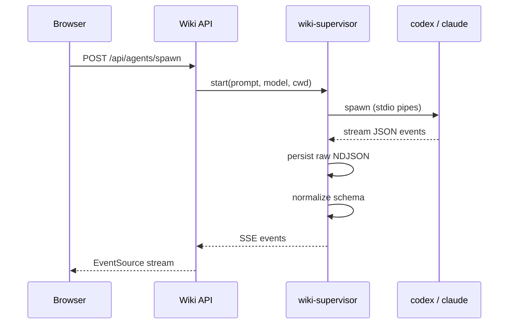

I don't really have a workflow, in the way that people who write about workflows do. I have a pile of small tools I built whenever the previous version stopped working. This post is about the pile — how it got here, what it looks like now, and where I'm trying to take it.

The pile has a name. I call it Wiki. It's a local markdown vault, a small FastAPI backend, a React browser, a Tauri desktop shell, and a daemon that babysits my coding agents. I use it every day. Nobody else does. It's not a product and I'm not going to try to make it one. I'm writing about it because a few pieces of the shape might be useful to somebody who's run into the same walls I did.

> [!side] The honest version: this is what my setup happens to look like today. It'll look different in three months.

| Metric | Value |
|--------|-------|
| Vault notes | **46** |
| Backend modules | **15** |
| Frontend modules | **36** |
| WIKI-* commits since start | **96** |
| Tool notes (agent runbooks) | **22** |

---

## v0 — Pane Scraping And Prayer

The version right before this one already had the shape of an orchestrator and workers, but everything above and around it was held together by hand.

Here's what a day looked like. I'd have one Claude Code session open that I treated as an orchestrator — its job was to think with me about what needed doing, then create Linear tickets for the pieces. Once a ticket existed, I'd pop open a fresh Codex window in tmux, invoke a skill I'd written called `/tmux-ticket-codex` (with a Claude sibling, `/tmux-ticket-claude`) on the ticket id, and let Codex loose. Then I'd babysit it — checking on it, unsticking it, answering its questions, reading its diff, telling it to open the PR — until the thing shipped.

Those two `tmux-ticket-*` skills were the closest thing v0 had to a runtime, and honestly they were pretty rickety. Each one was a markdown file describing how to spawn a worker: name the tmux window `cdx:PHO-1234` or `cc:PHO-1234`, write the kickoff prompt to a `/tmp` file, invoke the CLI, and then — this is the part — monitor by running `tmux capture-pane -p -t <window>` in a loop and grepping for a spinner or a sentinel string. Pane scraping. That's what monitoring meant.

One ticket at a time, this was fine. Two tickets, two Codex windows, two tabs of attention. Four tickets and I had four windows and no attention left.

It worked well enough for months, honestly. The pieces I wanted to keep were already there — the ticket-shaped unit of work, the skill file as a repeatable recipe, the split between a thinker and an implementer. What broke was the manual parts, and the parts that pretended tmux was a real API. Every worker was a job I had to hold in my head. Pane scraping was fine until a worker paraphrased "done" into a phrase I hadn't anticipated. I'd come back the next morning and forget which branch was which. A worker would confidently claim a fix was done and it wasn't, and I'd only find out by hand. Handing off between sessions was hopeless — the second session had no idea what the first had learned.

I didn't sit down and design a system. I fixed one manual step, then the next, and after a while there was enough scaffolding around me that it made sense to give it a name.

---

## What I Kept

Before I get into what I replaced, I want to be honest about what I didn't. Most of v0 is still there, underneath.

**tmux, as a keybinding metaphor.** I still live in tmux for shell work — `make dev`, `git`, grep, all of it. I copied its leader key idea (`Ctrl-A`) into the wiki app so pane navigation feels the same across shell and browser. I didn't want a whole new muscle memory just because I built a new app.

**Markdown files.** The vault is plain markdown in a directory. No database, no proprietary format, no schema. I tried a fancier setup twice and both times I regretted it. Markdown files are readable by everything, including me at 2am. That was worth more than any query performance.

**One PR per ticket, small diffs, verify before you claim done.** This was already how I worked, and none of the automation is worth anything if the ticket-shaped unit of work goes away. My agents get held to the same shape.

**The split between a thinker and an implementer.** In v0 this was Claude as orchestrator, Codex as worker. I kept the split — the new setup just automates the parts I was doing by hand.

**Skills as recipes.** `/tmux-ticket-codex`, `/tmux-ticket-claude`, and `/linear-ticket-to-pr` were the workhorses of v0. They still are, mostly unchanged in shape. What changed is what they call underneath.

**Claude Code and Codex as they are.** I never wanted to write my own agent. I wanted to drive the ones that already exist better. Everything I built is a shell around them.

---

## v1 — What Broke, And What I Built

### Context evaporation → the vault

The first thing that got old was re-explaining myself. Every fresh Claude session started at zero. I'd spend the first five minutes typing "the branch is X, the incident is Y, the convention here is Z." After the third day of that I started writing those bullets into a note I called `hot.md` and pasting it as my first message. Saved real time within a week.

The habit grew. If I locked a decision, I wrote it down. If I hit a weird gotcha, I wrote it down. If a PR merged, I logged a line to `done.md`. Eventually it was a whole directory:

| File | Role |
|------|------|
| `map.md` | Topic index. Every note listed with a one-line hook. Agents read this first, before grepping. |
| `hot.md` | ≤500 words of current context. Auto-injected into the first turn of every Claude session. |
| `todo.md` | Cross-project scrap list. Agents move lines to "In Progress" when they claim work. |
| `log/done.md` | One line per merged PR. Global tally. |
| `tools/*.md` | Runbooks for external systems and agent protocols. |

The important thing is that the agents write to it too. When one of my workers merges a PR, it appends a `done.md` line before it exits. When it learns something evergreen, it writes a til note. When it hits a work-arc boundary, it rewrites `hot.md`. I don't do any of this by hand anymore — I just keep the vault format sane, and a small CLI called `wiki` handles the atomic writes so nothing drifts out of shape.

> [!side] What actually makes this work isn't the vault schema. It's that every agent knows it's supposed to write.

### Pane scraping → a status-file protocol

The next thing that got old was the grepping. `/tmux-ticket-codex` was already producing structured behavior from the worker — the skill told the worker to update a JSON file at `/tmp/agent-status/<TICKET>.json` on every state transition. The orchestrator side of the skill grew to poll that file instead of the pane text. Way less brittle.

```json
{
  "state": "working | merge-ready | blocked",
  "pr": "https://github.com/.../pull/1234",
  "step": "running verification script",
  "blocker": null
}
```

Workers rewrite this on every state transition. The orchestrator polls it and treats each change as a notification. There are three signal sources it looks at, in priority order: the status file, GitHub ground truth (`gh pr checks`, unresolved threads), and pane text as a last-resort hint. When a worker claims `merge-ready`, the orchestrator does not trust it — it runs an independent review gate before merging.

Multi-session tickets survive through PR handoff comments. If a worker runs out of context, it writes a "done so far / remaining / file map" comment on its own PR, sets `blocker: handoff-needed`, and stops. A fresh worker respawns on the same worktree with a prompt pointing at that comment. Cross-session memory without any conversation compaction magic.

Both `tmux-ticket-*` skills bloated to about ten pages each in the process of getting this stable. They're the longest skills I have. The size isn't the point — the point is that they're the codified version of every "oh, *that's* why the worker got stuck" moment I had for six months.

### Tmux as an agent runtime → the headless supervisor

Even with the status-file protocol working, tmux was doing a job it wasn't designed to do. Closing my laptop killed the tmux server, which killed every worker. Every reboot lost state. The pane logs were the only real record of what happened, and they contained the echoed prompt text, which broke sentinel greps in some really dumb ways.

The other pain was `send-keys`. Sending a message to a worker meant `tmux send-keys -l "message"`, `sleep 0.5`, `send-keys Enter`. That 0.5 was load-bearing because the composer's paste-detection would treat a same-cycle Enter as a newline. About once every fifty messages, the sleep raced badly and the message just sat in the composer, unsubmitted. I'd notice five minutes later. Very annoying.

I spent two weeks in July ripping all of it out. The replacement is a detached daemon called `wiki-supervisor` that listens on a 0600 Unix socket and owns the provider CLIs directly.



Codex talks JSON-RPC over `codex app-server --stdio`. Claude Code talks stream-json over `claude -p`. The daemon normalizes both into a single event schema and broadcasts. Raw events land in NDJSON on disk before normalization, so if the normalizer has a bug I still have ground truth.

What I got out of the rewrite is basically everything I always wanted from tmux and never had: workers that survive laptop reboots, an event stream that reaches the browser as fast as the provider CLI can produce it, and a `send_now` / `send_on_idle` split that lets me queue a follow-up without interrupting an in-flight turn.

The `tmux-ticket-*` skills survived, which honestly surprised me. They now spawn workers through `POST /api/agents/spawn` instead of `tmux new-window`, monitor through SSE instead of `capture-pane`, and steer through `POST /api/agents/<id>/message` instead of `send-keys`. But the shape of the skill — kickoff prompt, status contract, sentinel language, wrap-up — didn't change. The interface stayed. The runtime under it moved. I'll come back to that.

I do miss the debuggability of a tmux pane. I can't just attach and eyeball what a worker's doing anymore. But the tradeoff was worth it, and I haven't once wanted to go back.

### Nowhere to sit and steer from → the wiki app

Once the supervisor existed, I needed a place to watch it from. Alt-tabbing between Obsidian, a terminal, GitHub, and Linear was the last manual part I hadn't killed.

The wiki app started life as a boring note viewer. Then it grew a graph. Then a kanban view of `todo.md`. Then, one day, I realized the tmux window I was using to hold my Codex session could just… be a pane inside the app. Once agents became first-class panes, the app stopped being a note viewer and became the thing I open first thing in the morning.


<figcaption style="text-align:center;font-size:0.85em;opacity:0.65;margin-top:-0.5em;margin-bottom:1.5em;">Wiki.app v1 — the current build, mid-workday.</figcaption>

The workspace is a tmux-like grid of panes. Each pane holds one thing — a note, an agent session, a terminal, a kanban board, a graph. Layout persists across restarts. `Ctrl-A` arms a chip; `Ctrl-A j`/`k` cycle panes; `Ctrl-A h`/`l` cycle windows; `Ctrl-A z` zooms; `Ctrl-A ,` opens settings. I didn't want to learn new keybindings and I mostly didn't have to.

The editor is a from-scratch Obsidian-style markdown component. Wikilinks, KaTeX, Mermaid, callouts, syntax-highlighted code — all rendered in place while the cursor sits inside them. Kanban notes render as a drag-drop board that syncs back to the file.

Everything else grew on top in roughly the order I felt the pain: an agents page listing every live worker grouped by orchestrator, a health page for supervisor and account status, a tokens page for spend, an activity feed, and a settings modal. Most of them exist because I noticed I kept switching windows for the same information.

The whole thing is a Tauri shell around the same web frontend, so I develop it like a normal web app and only build the native bundle when I want to ship a release to myself.

### Agents rationalizing past rules → skills with reasons

Last piece is the smallest. Skills are markdown files that tell an agent how to do a specific thing.

I tried writing behavior guides as flat rules first. They did not survive contact with a model that's good at rationalizing. What did work was writing each rule with a *reason*: "do X because Y burned us last time." When the model can see the failure a rule prevents, it respects it. When it can only see the rule, it argues.

The ones I use every day, beyond the two `tmux-ticket-*` recipes: `wiki-vault` (read and write the vault at trigger moments), `linear-ticket-to-pr` (plan and ship a ticket end to end), `henry-review` (review a diff in my voice), `brainstorming` (ask one question at a time before writing code), and `verification-before-completion` (never claim done without running the verification command).

---

## v2 — What I Want Next

The current app works, but the more I use it the more I notice it's a really good note viewer with agent panes bolted on. What I actually want is the inverse. An editor whose native unit is an agent-driven pane, and whose text-editing surface is at least as good as a real IDE.

Roughly where I want to push it:

**Rewrite the app in GPUI.** React and Tauri were the fastest path to v1. They're not the fastest path to rendering an agent event stream at 60fps while I'm typing in a code buffer next to it. GPUI — the framework Zed uses — is where I want the rendering pipeline to live next. Tauri is fine for chrome; GPUI is what I want under the editor and under the agent panes. I haven't started the port. I've been reading Zed's source and taking notes.

**A real code editor, not a markdown viewer.** LSP servers, tree-sitter, multi-buffer views, diff gutters, blame, semantic navigation. All of it. Right now I bounce between the wiki app and VS Code for anything that isn't a note, and I want to stop bouncing. The vault becomes one workspace inside the editor; every open repo is another.

**Agents as buffers, not sidebars.** Right now an agent pane is a viewer over an event stream. In v2 I want the agent session to *be* a buffer alongside my code buffers, with its own textual affordances — jump to the file it just edited, follow the tool call that just ran, scroll back through its plan revisions like git blame. The agent stream and the code it produces should live in the same object graph.

**Continuous canvas alongside the pane grid.** The current split-pane model is fast but rigid. I also want a spatial canvas — infinite scroll, snap-to-grid, zoomable — where notes, agent sessions, PR reviews, and diagrams live as movable cards with lines drawn between them. Pane grid stays as the keyboard fallback. The canvas is where I plan.

**A situation view that isn't the notes view.** When I open the app in the morning I don't want a file tree. I want to see: what my fleet is doing, what PRs are waiting on me, what tickets are open, what changed in the vault overnight, what the top of `hot.md` says. Closer to a mission-control page than an editor start screen.

None of this is close to done. It's just where the next batch of tickets is pointed. The lesson from v0 → v1 was that the interface layer (skills, kickoff prompts, status contracts) is way more portable than I would've guessed, and the runtime under it can be replaced without breaking the workflow above. v2 is a bet that the same trick works one level up: the wiki-app frontend can be replaced with a GPUI-native editor without breaking the vault, the supervisor, or the skills.

---

## What Actually Makes It Work

I want to be careful here, because the tools are the visible part and the tools are not what's actually doing the work. Vault-as-shared-memory isn't a big idea. Neither is a headless supervisor, or a status-file protocol. Any decent engineer could reproduce any of these in a weekend.

The thing doing the actual work is the habit. Every agent I run assumes there's prior context in the vault and refuses to start without reading `map.md` first. Every merged PR ends with a `done.md` line. When something surprises me, I write it down before I forget. When I hit a work-arc boundary, I rewrite `hot.md` before I sleep.

The tools follow from the habits, not the other way around. If I stopped keeping the vault current, the app would still boot and the supervisor would still hum along, and my agents would slowly drift right back to where they were six months ago. If you steal any part of this, steal the habit first and worry about the code later.

---

## What This Isn't

This isn't a product. It's single-user, single-machine, and calibrated for exactly how I think. Some pieces of the shape might be worth stealing. Most of it is going to look different next quarter, because I'll have found the next thing that stopped working.

I'm publishing it because I wanted to write down what the pile currently looks like, honestly, before I forget.
